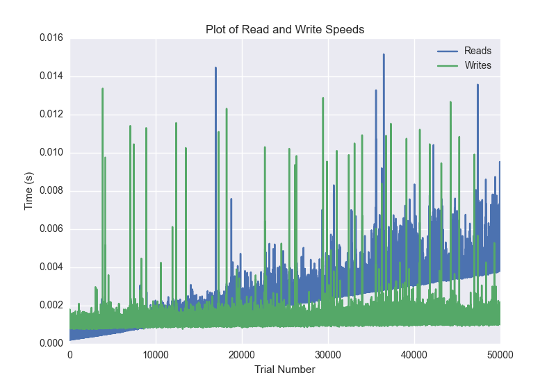
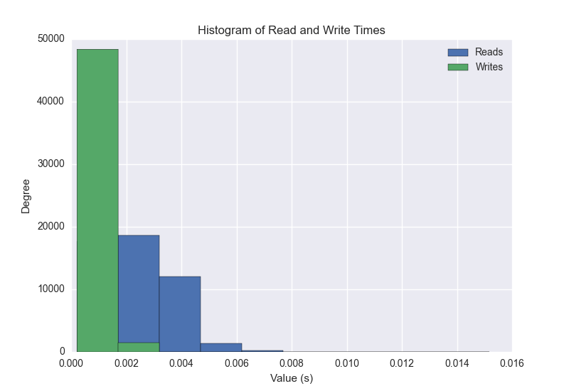
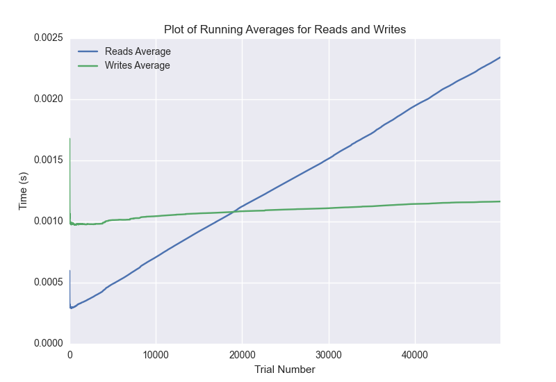

DATABASE BENCHMARKING REPORT - POSTGRESQL - 50000 Trials
=========================================

This report has been automatically generated from a Benchmarking application
built by [Kurtis Jungersen](http://kmjungersen.com).  The source behind the application can be found on the [project's GitHub.](https://github.com/kmjungersen/DB-Benchmarking)

TIME AND DATE
=============

Tue, 16 Dec, 2014 12:03:12

RESULTS
=======

After using these parameters:

| Parameter                  | Value      |
|:---------------------------|:-----------|
| Database Tested            | POSTGRESQL |
| Number of Trials           | 50000      |
| Length of Each Entry Field | 10         |
| Number of Nodes in Cluster | 3          |
| Split Reads and Writes     | False      |
| Debug Mode                 | False      |
| Chaos Mode (Random Reads)  | True       |

These results were obtained:

| Operation   |   Average |   St. Dev. |   Max Time |   Min Time |   Range |
|:------------|----------:|-----------:|-----------:|-----------:|--------:|
| Writes      |   0.00172 |    0.01367 |    0.40088 |    0.00077 | 0.40011 |
| Reads       |   0.00302 |    0.01594 |    0.79652 |    0.00021 | 0.79631 |

This plot shows the normalized speeds of reads and writes over the course of the benchmark.  The data was normalized (i.e. any data points beyond 3 standard deviations of the mean were excluded).

This plot shows a histogram which describes the general distribution of the data.

This plot shows the running averages for read and write speeds over the course of the benchmark.

Note: If any outliers were obtained in this benchmark, they will displayed here:

| Operation   |   Trial Number |     Value |
|:------------|---------------:|----------:|
| Write       |            210 | 0.396378  |
| Write       |            241 | 0.056716  |
| Write       |            639 | 0.363274  |
| Write       |            830 | 0.336147  |
| Write       |            928 | 0.350144  |
| Write       |            976 | 0.34519   |
| Write       |           1077 | 0.360817  |
| Write       |           1097 | 0.371284  |
| Write       |           1626 | 0.342539  |
| Write       |           1991 | 0.369017  |
| Write       |           2039 | 0.346742  |
| Write       |           2684 | 0.323381  |
| Write       |           2755 | 0.173293  |
| Write       |           2865 | 0.351328  |
| Write       |           2881 | 0.375457  |
| Write       |           3310 | 0.321459  |
| Write       |           3596 | 0.336786  |
| Write       |           3715 | 0.307111  |
| Write       |           3735 | 0.367112  |
| Write       |           3822 | 0.352567  |
| Write       |           3992 | 0.374405  |
| Write       |           4145 | 0.0157502 |
| Write       |           4192 | 0.376644  |
| Write       |           4310 | 0.364568  |
| Write       |           4616 | 0.182428  |
| Write       |           4640 | 0.32048   |
| Write       |           4694 | 0.303501  |
| Write       |           4952 | 0.33477   |
| Write       |           5231 | 0.317554  |
| Write       |           5285 | 0.308511  |
| Write       |           5350 | 0.379213  |
| Write       |           5397 | 0.317478  |
| Write       |           5690 | 0.365149  |
| Write       |           5720 | 0.161126  |
| Write       |           5771 | 0.379858  |
| Write       |           5880 | 0.302222  |
| Write       |           8739 | 0.0725179 |
| Write       |          13461 | 0.16856   |
| Write       |          13625 | 0.019377  |
| Write       |          14036 | 0.317017  |
| Write       |          14202 | 0.362259  |
| Write       |          15943 | 0.324773  |
| Write       |          16411 | 0.391368  |
| Write       |          16585 | 0.336284  |
| Write       |          17187 | 0.359871  |
| Write       |          17445 | 0.384265  |
| Write       |          18194 | 0.30821   |
| Write       |          19254 | 0.336724  |
| Write       |          19634 | 0.325048  |
| Write       |          20183 | 0.361683  |
| Write       |          20585 | 0.336195  |
| Write       |          20646 | 0.311199  |
| Write       |          21439 | 0.318766  |
| Write       |          22454 | 0.350007  |
| Write       |          22497 | 0.365026  |
| Write       |          22716 | 0.400883  |
| Write       |          23019 | 0.361981  |
| Write       |          23166 | 0.315752  |
| Write       |          23794 | 0.387926  |
| Write       |          23981 | 0.1766    |
| Write       |          24257 | 0.324096  |
| Write       |          24503 | 0.101198  |
| Write       |          24889 | 0.394403  |
| Write       |          24928 | 0.361148  |
| Write       |          25029 | 0.34274   |
| Write       |          25349 | 0.37033   |
| Write       |          25399 | 0.325231  |
| Write       |          25550 | 0.358966  |
| Write       |          26039 | 0.376274  |
| Write       |          26152 | 0.178522  |
| Write       |          26262 | 0.311585  |
| Write       |          26308 | 0.338058  |
| Write       |          26349 | 0.338751  |
| Write       |          26355 | 0.255671  |
| Write       |          26412 | 0.344246  |
| Write       |          27364 | 0.305132  |
| Write       |          28217 | 0.316577  |
| Write       |          28628 | 0.327738  |
| Write       |          30300 | 0.311156  |
| Write       |          30657 | 0.0243061 |
| Write       |          32757 | 0.308669  |
| Write       |          34280 | 0.387268  |
| Write       |          35691 | 0.394903  |
| Write       |          37422 | 0.353349  |
| Write       |          38703 | 0.309899  |
| Write       |          44777 | 0.370876  |
| Write       |          45999 | 0.323793  |
| Write       |          46528 | 0.0365551 |
| Write       |          47620 | 0.398738  |
| Write       |          48370 | 0.263403  |
| Read        |           1077 | 0.399708  |
| Read        |           1993 | 0.279097  |
| Read        |           3368 | 0.305755  |
| Read        |           4261 | 0.35724   |
| Read        |           4285 | 0.361331  |
| Read        |           4856 | 0.394573  |
| Read        |           5071 | 0.390773  |
| Read        |           5285 | 0.401515  |
| Read        |           6362 | 0.110326  |
| Read        |           6794 | 0.750893  |
| Read        |           7154 | 0.327882  |
| Read        |           7754 | 0.0391929 |
| Read        |           8035 | 0.729287  |
| Read        |           8163 | 0.323517  |
| Read        |           8480 | 0.323551  |
| Read        |           8642 | 0.347722  |
| Read        |           9311 | 0.35013   |
| Read        |           9852 | 0.394229  |
| Read        |          10313 | 0.337489  |
| Read        |          11405 | 0.357574  |
| Read        |          11611 | 0.307485  |
| Read        |          12495 | 0.395586  |
| Read        |          12747 | 0.302856  |
| Read        |          15054 | 0.385751  |
| Read        |          15087 | 0.313301  |
| Read        |          15199 | 0.40225   |
| Read        |          15474 | 0.359169  |
| Read        |          15732 | 0.304031  |
| Read        |          16067 | 0.144961  |
| Read        |          16408 | 0.365911  |
| Read        |          16525 | 0.377604  |
| Read        |          16982 | 0.363471  |
| Read        |          17171 | 0.365332  |
| Read        |          17187 | 0.268347  |
| Read        |          17563 | 0.364806  |
| Read        |          18742 | 0.342878  |
| Read        |          18839 | 0.320877  |
| Read        |          18858 | 0.348452  |
| Read        |          19199 | 0.307123  |
| Read        |          19974 | 0.312691  |
| Read        |          20542 | 0.371664  |
| Read        |          20565 | 0.332547  |
| Read        |          20934 | 0.400946  |
| Read        |          21382 | 0.373168  |
| Read        |          22993 | 0.295314  |
| Read        |          23197 | 0.399667  |
| Read        |          23713 | 0.338245  |
| Read        |          23760 | 0.343556  |
| Read        |          23877 | 0.311906  |
| Read        |          24062 | 0.399997  |
| Read        |          24778 | 0.379236  |
| Read        |          26003 | 0.397932  |
| Read        |          26396 | 0.358976  |
| Read        |          26483 | 0.349987  |
| Read        |          27256 | 0.392089  |
| Read        |          27790 | 0.318527  |
| Read        |          28422 | 0.331271  |
| Read        |          28709 | 0.224693  |
| Read        |          28947 | 0.375234  |
| Read        |          29153 | 0.310527  |
| Read        |          29436 | 0.0195849 |
| Read        |          29595 | 0.796523  |
| Read        |          29898 | 0.404916  |
| Read        |          30410 | 0.321342  |
| Read        |          30656 | 0.0315349 |
| Read        |          30657 | 0.024334  |
| Read        |          30901 | 0.318089  |
| Read        |          31733 | 0.384367  |
| Read        |          32675 | 0.330785  |
| Read        |          32991 | 0.253118  |
| Read        |          34990 | 0.370649  |
| Read        |          35006 | 0.334045  |
| Read        |          35082 | 0.353608  |
| Read        |          35912 | 0.401768  |
| Read        |          35918 | 0.367683  |
| Read        |          36457 | 0.33099   |
| Read        |          36646 | 0.310311  |
| Read        |          36993 | 0.316108  |
| Read        |          37100 | 0.382721  |
| Read        |          37214 | 0.353253  |
| Read        |          37264 | 0.104805  |
| Read        |          37589 | 0.136772  |
| Read        |          37817 | 0.399556  |
| Read        |          38131 | 0.328181  |
| Read        |          38421 | 0.325613  |
| Read        |          38706 | 0.389849  |
| Read        |          39216 | 0.074785  |
| Read        |          40039 | 0.314672  |
| Read        |          40260 | 0.324846  |
| Read        |          40557 | 0.370703  |
| Read        |          40648 | 0.325138  |
| Read        |          41105 | 0.344824  |
| Read        |          41814 | 0.333305  |
| Read        |          43573 | 0.395454  |
| Read        |          43688 | 0.339218  |
| Read        |          44265 | 0.360795  |
| Read        |          45671 | 0.324124  |
| Read        |          45926 | 0.33404   |
| Read        |          48791 | 0.368671  |
| Read        |          49080 | 0.374826  |
| Read        |          49787 | 0.456561  |