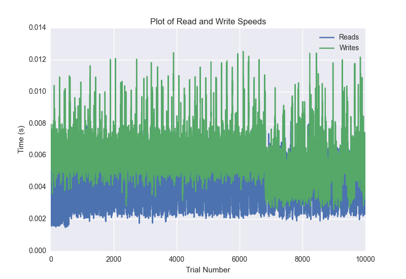
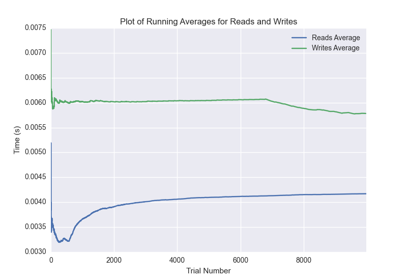

DATABASE BENCHMARKING REPORT - RIAK2 - 10000 Trials
=========================================

This report has been automatically generated from a Benchmarking application
built by [Kurtis Jungersen](http://kmjungersen.com).  The source behind the application can be found on the [project's GitHub.](https://github.com/kmjungersen/DB-Benchmarking)

TIME AND DATE
=============

Mon, 17 Nov, 2014 16:00:52

RESULTS
=======

After using these parameters:

| Parameter                  | Value   |
|:---------------------------|:--------|
| Database Tested            | RIAK2   |
| Number of Trials           | 10000   |
| Length of Each Entry Field | 10      |
| Number of Nodes in Cluster | 3       |
| Split Reads and Writes     | True    |
| Debug Mode                 | False   |
| Chaos Mode (Random Reads)  | True    |

These results were obtained:

| Operation   |   Average |   St. Dev. |   Max Time |   Min Time |   Range |
|:------------|----------:|-----------:|-----------:|-----------:|--------:|
| Writes      |   0.00585 |    0.00224 |    0.13524 |    0.00262 | 0.13262 |
| Reads       |   0.00418 |    0.00134 |    0.01571 |    0.00149 | 0.01422 |

This plot shows the normalized speeds of reads and writes over the course of the benchmark.  The data was normalized (i.e. any data points beyond 3 standard deviations of the mean were excluded).

This plot shows a histogram which describes the general distribution of the data.

This plot shows the running averages for read and write speeds over the course of the benchmark.

Note: If any outliers were obtained in this benchmark, they will displayed here:

| Operation   |   Trial Number |      Value |
|:------------|---------------:|-----------:|
| Write       |              0 | 0.135244   |
| Write       |            779 | 0.061672   |
| Write       |           1240 | 0.019779   |
| Write       |           1243 | 0.0211859  |
| Write       |           1244 | 0.017921   |
| Write       |           1247 | 0.0338919  |
| Write       |           1249 | 0.0172648  |
| Write       |           1250 | 0.0144241  |
| Write       |           1251 | 0.0149541  |
| Write       |           1252 | 0.0237951  |
| Write       |           1571 | 0.0430181  |
| Write       |           1964 | 0.015414   |
| Write       |           2895 | 0.0136261  |
| Write       |           3077 | 0.0132511  |
| Write       |           4757 | 0.0135601  |
| Write       |           5095 | 0.015281   |
| Write       |           5602 | 0.0127871  |
| Write       |           5777 | 0.012804   |
| Write       |           6476 | 0.0720851  |
| Write       |           6794 | 0.012974   |
| Write       |           6808 | 0.0180049  |
| Write       |           6809 | 0.015054   |
| Write       |           6810 | 0.0130279  |
| Write       |           6820 | 0.0128551  |
| Write       |           7679 | 0.01424    |
| Write       |           8233 | 0.0462298  |
| Write       |           8297 | 0.0567391  |
| Write       |           8411 | 0.014729   |
| Write       |           8447 | 0.0150471  |
| Write       |           8632 | 0.0165639  |
| Write       |           8638 | 0.01652    |
| Write       |           8721 | 0.019835   |
| Write       |           9105 | 0.022814   |
| Write       |           9145 | 0.014261   |
| Write       |           9395 | 0.013005   |
| Write       |           9844 | 0.0128341  |
| Read        |              0 | 0.0157061  |
| Read        |            745 | 0.010005   |
| Read        |            746 | 0.00879312 |
| Read        |            747 | 0.00876307 |
| Read        |            748 | 0.00862408 |
| Read        |           1086 | 0.00999498 |
| Read        |           1317 | 0.00848889 |
| Read        |           1419 | 0.008322   |
| Read        |           1569 | 0.00850916 |
| Read        |           3126 | 0.011117   |
| Read        |           3137 | 0.00839806 |
| Read        |           3138 | 0.010762   |
| Read        |           3587 | 0.00851107 |
| Read        |           4989 | 0.00829506 |
| Read        |           5501 | 0.0131369  |
| Read        |           7629 | 0.00893283 |
| Read        |           9635 | 0.00969195 |
| Read        |           9735 | 0.00904298 |