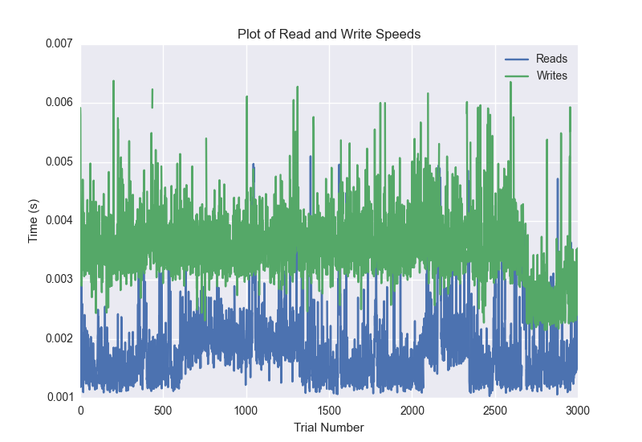
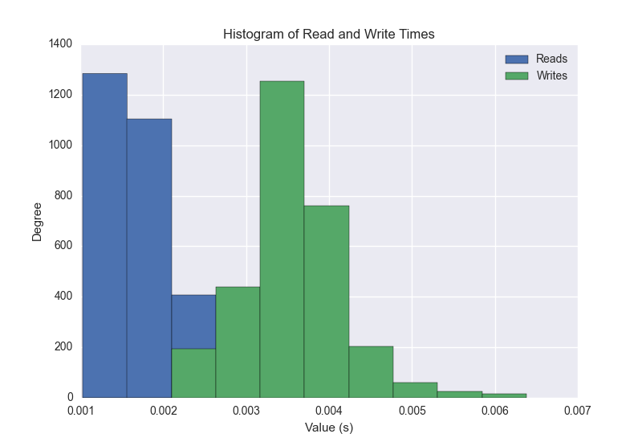
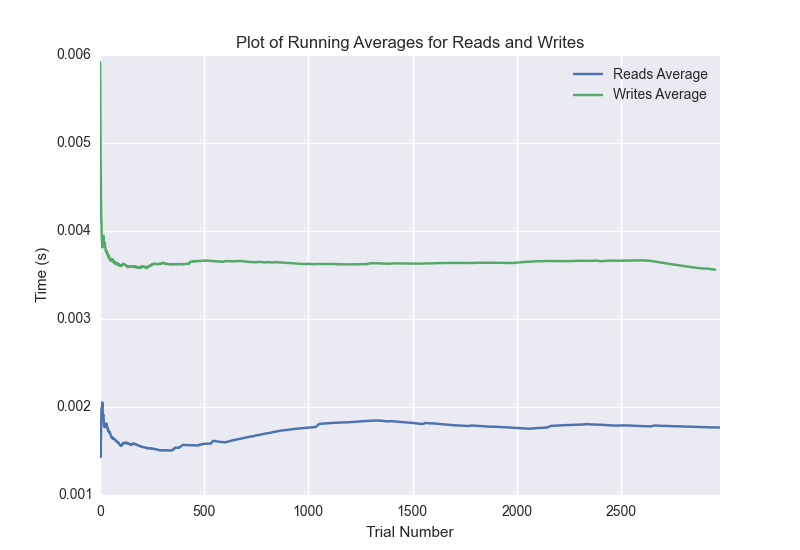

DATABASE BENCHMARKING REPORT - RIAK2 - 3000 Trials
=========================================

This report has been automatically generated from a Benchmarking application
built by [Kurtis Jungersen](http://kmjungersen.com).  The source behind the application can be found on the [project's GitHub.](https://github.com/kmjungersen/DB-Benchmarking)

TIME AND DATE
=============

Mon, 17 Nov, 2014 15:59:39

RESULTS
=======

After using these parameters:

| Parameter                  | Value   |
|:---------------------------|:--------|
| Database Tested            | RIAK2   |
| Number of Trials           | 3000    |
| Length of Each Entry Field | 10      |
| Number of Nodes in Cluster | 3       |
| Split Reads and Writes     | True    |
| Debug Mode                 | False   |
| Chaos Mode (Random Reads)  | True    |

These results were obtained:

| Operation   |   Average |   St. Dev. |   Max Time |   Min Time |   Range |
|:------------|----------:|-----------:|-----------:|-----------:|--------:|
| Writes      |   0.00364 |    0.00092 |    0.02167 |    0.00215 | 0.01952 |
| Reads       |   0.00185 |    0.00117 |    0.02608 |    0.00103 | 0.02505 |

This plot shows the normalized speeds of reads and writes over the course of the benchmark.  The data was normalized (i.e. any data points beyond 3 standard deviations of the mean were excluded).

This plot shows a histogram which describes the general distribution of the data.

This plot shows the running averages for read and write speeds over the course of the benchmark.

Note: If any outliers were obtained in this benchmark, they will displayed here:

| Operation   |   Trial Number |      Value |
|:------------|---------------:|-----------:|
| Write       |            228 | 0.00689197 |
| Write       |            402 | 0.00645995 |
| Write       |            433 | 0.00674391 |
| Write       |            436 | 0.00687003 |
| Write       |            487 | 0.00648999 |
| Write       |            488 | 0.00712514 |
| Write       |            757 | 0.007658   |
| Write       |            758 | 0.00786495 |
| Write       |            804 | 0.00687099 |
| Write       |           1030 | 0.00775409 |
| Write       |           1031 | 0.0122609  |
| Write       |           1032 | 0.00766397 |
| Write       |           1206 | 0.00795007 |
| Write       |           1299 | 0.00880909 |
| Write       |           1300 | 0.00894904 |
| Write       |           1328 | 0.00687194 |
| Write       |           1568 | 0.00872803 |
| Write       |           1569 | 0.010169   |
| Write       |           1570 | 0.007447   |
| Write       |           1834 | 0.0115991  |
| Write       |           1835 | 0.011147   |
| Write       |           1836 | 0.00703597 |
| Write       |           2010 | 0.00710607 |
| Write       |           2037 | 0.0126688  |
| Write       |           2092 | 0.00873685 |
| Write       |           2093 | 0.01017    |
| Write       |           2094 | 0.00935507 |
| Write       |           2095 | 0.0086019  |
| Write       |           2164 | 0.00727415 |
| Write       |           2325 | 0.0072341  |
| Write       |           2326 | 0.010628   |
| Write       |           2327 | 0.00839305 |
| Write       |           2328 | 0.0107381  |
| Write       |           2329 | 0.00706291 |
| Write       |           2348 | 0.00844598 |
| Write       |           2349 | 0.010597   |
| Write       |           2350 | 0.0089922  |
| Write       |           2351 | 0.00764704 |
| Write       |           2388 | 0.021668   |
| Write       |           2546 | 0.00640798 |
| Write       |           2608 | 0.00889611 |
| Write       |           2609 | 0.00873494 |
| Write       |           2610 | 0.00817704 |
| Write       |           2611 | 0.00646305 |
| Write       |           2668 | 0.00682092 |
| Write       |           2951 | 0.0068481  |
| Read        |           1328 | 0.00956988 |
| Read        |           1487 | 0.0197399  |
| Read        |           1493 | 0.0260789  |
| Read        |           1494 | 0.0112669  |
| Read        |           1511 | 0.00964689 |
| Read        |           1565 | 0.0102689  |
| Read        |           2024 | 0.00759482 |
| Read        |           2032 | 0.0115499  |
| Read        |           2168 | 0.00590205 |
| Read        |           2170 | 0.00538802 |
| Read        |           2339 | 0.00620508 |
| Read        |           2392 | 0.0225689  |
| Read        |           2393 | 0.022043   |
| Read        |           2394 | 0.021785   |
| Read        |           2518 | 0.00609207 |
| Read        |           2558 | 0.00623918 |
| Read        |           2628 | 0.0107219  |
| Read        |           2639 | 0.0140631  |
| Read        |           2663 | 0.00577998 |
| Read        |           2664 | 0.0108938  |
| Read        |           2665 | 0.0146651  |
| Read        |           2669 | 0.00875592 |
| Read        |           2835 | 0.007447   |