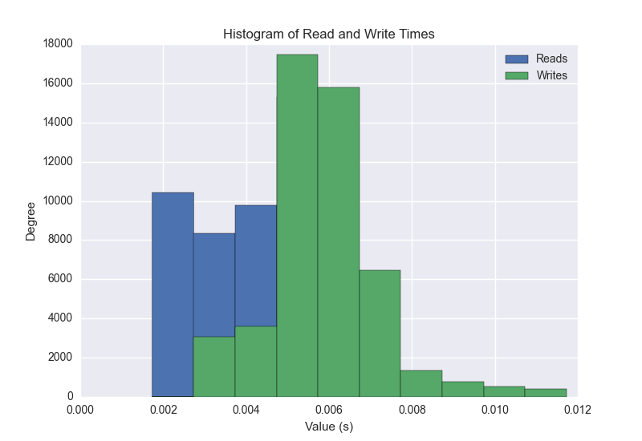
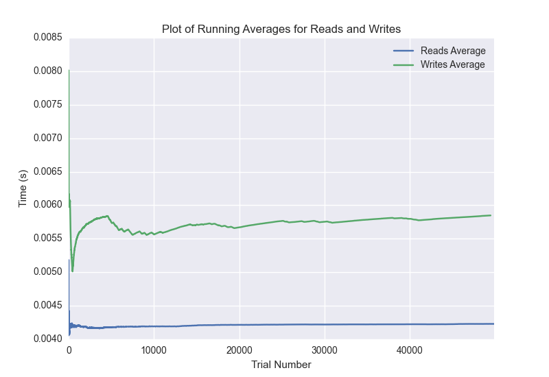

DATABASE BENCHMARKING REPORT - RIAK2 - 50000 Trials
=========================================

This report has been automatically generated from a Benchmarking application
built by [Kurtis Jungersen](http://kmjungersen.com).  The source behind the application can be found on the [project's GitHub.](https://github.com/kmjungersen/DB-Benchmarking)

TIME AND DATE
=============

Mon, 17 Nov, 2014 16:04:23

RESULTS
=======

After using these parameters:

| Parameter                  | Value   |
|:---------------------------|:--------|
| Database Tested            | RIAK2   |
| Number of Trials           | 50000   |
| Length of Each Entry Field | 10      |
| Number of Nodes in Cluster | 3       |
| Split Reads and Writes     | True    |
| Debug Mode                 | False   |
| Chaos Mode (Random Reads)  | True    |

These results were obtained:

| Operation   |   Average |   St. Dev. |   Max Time |   Min Time |   Range |
|:------------|----------:|-----------:|-----------:|-----------:|--------:|
| Writes      |   0.00594 |    0.00193 |    0.20674 |    0.00255 | 0.20419 |
| Reads       |   0.00424 |    0.00131 |    0.02184 |    0.00174 | 0.02010 |

This plot shows the normalized speeds of reads and writes over the course of the benchmark.  The data was normalized (i.e. any data points beyond 3 standard deviations of the mean were excluded).

This plot shows a histogram which describes the general distribution of the data.

This plot shows the running averages for read and write speeds over the course of the benchmark.

Note: If any outliers were obtained in this benchmark, they will displayed here:

| Operation   |   Trial Number |      Value |
|:------------|---------------:|-----------:|
| Write       |            172 | 0.012259   |
| Write       |           1054 | 0.028856   |
| Write       |           1055 | 0.0182152  |
| Write       |           1684 | 0.012543   |
| Write       |           3284 | 0.021487   |
| Write       |           3285 | 0.016057   |
| Write       |           3286 | 0.012702   |
| Write       |           4093 | 0.012532   |
| Write       |           4399 | 0.0187149  |
| Write       |           4435 | 0.0127771  |
| Write       |           4593 | 0.0157819  |
| Write       |           6476 | 0.0521641  |
| Write       |           6591 | 0.012845   |
| Write       |           6794 | 0.0147109  |
| Write       |           6953 | 0.0199051  |
| Write       |           6969 | 0.0122561  |
| Write       |           6973 | 0.0119462  |
| Write       |           7005 | 0.016331   |
| Write       |           8325 | 0.0131209  |
| Write       |           8326 | 0.0147481  |
| Write       |           8334 | 0.0161901  |
| Write       |           8904 | 0.012702   |
| Write       |           9343 | 0.0118549  |
| Write       |           9691 | 0.0119438  |
| Write       |           9695 | 0.01421    |
| Write       |           9696 | 0.0136302  |
| Write       |          10116 | 0.014029   |
| Write       |          10294 | 0.0117612  |
| Write       |          10300 | 0.013236   |
| Write       |          10341 | 0.015398   |
| Write       |          10657 | 0.0118911  |
| Write       |          10748 | 0.0130041  |
| Write       |          11055 | 0.0126541  |
| Write       |          11056 | 0.0121961  |
| Write       |          11233 | 0.0119948  |
| Write       |          11234 | 0.0130911  |
| Write       |          11239 | 0.0121369  |
| Write       |          11240 | 0.0126259  |
| Write       |          11416 | 0.0127671  |
| Write       |          11420 | 0.011868   |
| Write       |          11421 | 0.0118821  |
| Write       |          11594 | 0.0121839  |
| Write       |          11595 | 0.0123198  |
| Write       |          11600 | 0.012167   |
| Write       |          11772 | 0.0119078  |
| Write       |          11778 | 0.0126269  |
| Write       |          11779 | 0.013917   |
| Write       |          12128 | 0.0120399  |
| Write       |          12309 | 0.0119898  |
| Write       |          12310 | 0.01332    |
| Write       |          12315 | 0.0119739  |
| Write       |          12316 | 0.0123     |
| Write       |          12486 | 0.012095   |
| Write       |          12487 | 0.0128841  |
| Write       |          12663 | 0.013922   |
| Write       |          12664 | 0.012851   |
| Write       |          12669 | 0.0124209  |
| Write       |          12670 | 0.012809   |
| Write       |          12725 | 0.0118558  |
| Write       |          12837 | 0.0128961  |
| Write       |          12841 | 0.012845   |
| Write       |          12843 | 0.012964   |
| Write       |          12918 | 0.014354   |
| Write       |          13011 | 0.0120511  |
| Write       |          13187 | 0.013016   |
| Write       |          13188 | 0.0132098  |
| Write       |          13194 | 0.0139921  |
| Write       |          13366 | 0.0118899  |
| Write       |          13367 | 0.012373   |
| Write       |          13547 | 0.012928   |
| Write       |          13727 | 0.0129869  |
| Write       |          13728 | 0.012063   |
| Write       |          13733 | 0.0127318  |
| Write       |          13734 | 0.0132129  |
| Write       |          13907 | 0.0124352  |
| Write       |          13944 | 0.0123041  |
| Write       |          14116 | 0.0165811  |
| Write       |          14165 | 0.029875   |
| Write       |          14166 | 0.012249   |
| Write       |          14258 | 0.011837   |
| Write       |          14461 | 0.01179    |
| Write       |          14607 | 0.0165098  |
| Write       |          14608 | 0.0182002  |
| Write       |          14612 | 0.0135181  |
| Write       |          14613 | 0.014209   |
| Write       |          14616 | 0.0464849  |
| Write       |          14649 | 0.01246    |
| Write       |          14668 | 0.012255   |
| Write       |          14703 | 0.0283759  |
| Write       |          14761 | 0.0135419  |
| Write       |          14824 | 0.013202   |
| Write       |          14825 | 0.0158269  |
| Write       |          14826 | 0.0153029  |
| Write       |          14827 | 0.0128489  |
| Write       |          14829 | 0.0155489  |
| Write       |          14870 | 0.013854   |
| Write       |          14872 | 0.072722   |
| Write       |          14967 | 0.019058   |
| Write       |          14969 | 0.0525198  |
| Write       |          14985 | 0.0167279  |
| Write       |          14987 | 0.0123832  |
| Write       |          15010 | 0.0123661  |
| Write       |          15019 | 0.0160179  |
| Write       |          15024 | 0.017045   |
| Write       |          15074 | 0.0120711  |
| Write       |          15100 | 0.0271599  |
| Write       |          15107 | 0.0492339  |
| Write       |          15108 | 0.0276301  |
| Write       |          15128 | 0.0121429  |
| Write       |          15166 | 0.013185   |
| Write       |          15167 | 0.026551   |
| Write       |          15263 | 0.021559   |
| Write       |          15371 | 0.0141959  |
| Write       |          15480 | 0.016053   |
| Write       |          15502 | 0.013566   |
| Write       |          15503 | 0.0146558  |
| Write       |          15505 | 0.0133801  |
| Write       |          15506 | 0.015614   |
| Write       |          15507 | 0.02632    |
| Write       |          15674 | 0.0130498  |
| Write       |          15675 | 0.012084   |
| Write       |          15680 | 0.0124879  |
| Write       |          15681 | 0.013222   |
| Write       |          15685 | 0.0142019  |
| Write       |          15958 | 0.0123591  |
| Write       |          15978 | 0.019284   |
| Write       |          15983 | 0.016104   |
| Write       |          15986 | 0.0471411  |
| Write       |          15987 | 0.0125229  |
| Write       |          15988 | 0.0157759  |
| Write       |          16035 | 0.012924   |
| Write       |          16037 | 0.0118499  |
| Write       |          16228 | 0.01367    |
| Write       |          16230 | 0.013104   |
| Write       |          16252 | 0.0123551  |
| Write       |          16308 | 0.080647   |
| Write       |          16387 | 0.0126729  |
| Write       |          16459 | 0.012202   |
| Write       |          16463 | 0.0156388  |
| Write       |          16561 | 0.0130968  |
| Write       |          16564 | 0.012382   |
| Write       |          16566 | 0.011945   |
| Write       |          16700 | 0.0137639  |
| Write       |          16934 | 0.0135891  |
| Write       |          16960 | 0.0173709  |
| Write       |          16969 | 0.206736   |
| Write       |          17055 | 0.011827   |
| Write       |          17103 | 0.012543   |
| Write       |          17107 | 0.012372   |
| Write       |          17259 | 0.014235   |
| Write       |          17736 | 0.01244    |
| Write       |          17747 | 0.0152059  |
| Write       |          18143 | 0.012079   |
| Write       |          18144 | 0.0128369  |
| Write       |          18149 | 0.012136   |
| Write       |          18261 | 0.0123582  |
| Write       |          18262 | 0.0146391  |
| Write       |          18277 | 0.0326879  |
| Write       |          18320 | 0.012496   |
| Write       |          18321 | 0.012217   |
| Write       |          18474 | 0.0136549  |
| Write       |          18935 | 0.0139861  |
| Write       |          18939 | 0.0140109  |
| Write       |          18940 | 0.0211852  |
| Write       |          18941 | 0.0124249  |
| Write       |          19116 | 0.0127258  |
| Write       |          19161 | 0.0618582  |
| Write       |          19723 | 0.0120299  |
| Write       |          19724 | 0.0124061  |
| Write       |          19729 | 0.0122349  |
| Write       |          19730 | 0.0125339  |
| Write       |          19902 | 0.0128019  |
| Write       |          19903 | 0.014035   |
| Write       |          20083 | 0.013124   |
| Write       |          20187 | 0.022893   |
| Write       |          20261 | 0.012187   |
| Write       |          20262 | 0.0126121  |
| Write       |          20439 | 0.011919   |
| Write       |          20620 | 0.0130501  |
| Write       |          20716 | 0.0212739  |
| Write       |          20789 | 0.012219   |
| Write       |          20794 | 0.0129251  |
| Write       |          20963 | 0.0133872  |
| Write       |          20970 | 0.011801   |
| Write       |          21142 | 0.013201   |
| Write       |          21178 | 0.0147889  |
| Write       |          21184 | 0.014461   |
| Write       |          21313 | 0.012301   |
| Write       |          21314 | 0.011765   |
| Write       |          21320 | 0.0122259  |
| Write       |          21496 | 0.0120292  |
| Write       |          21670 | 0.0151     |
| Write       |          21850 | 0.0127339  |
| Write       |          21855 | 0.0134878  |
| Write       |          22031 | 0.0121882  |
| Write       |          22202 | 0.0124948  |
| Write       |          22208 | 0.014241   |
| Write       |          22378 | 0.013597   |
| Write       |          22379 | 0.018234   |
| Write       |          22384 | 0.011729   |
| Write       |          22554 | 0.011893   |
| Write       |          22555 | 0.0129321  |
| Write       |          22704 | 0.014606   |
| Write       |          22734 | 0.0133069  |
| Write       |          22739 | 0.0122609  |
| Write       |          22783 | 0.0152678  |
| Write       |          22784 | 0.0121949  |
| Write       |          22907 | 0.012167   |
| Write       |          22908 | 0.012712   |
| Write       |          22912 | 0.0119531  |
| Write       |          22914 | 0.012557   |
| Write       |          22919 | 0.016057   |
| Write       |          23091 | 0.012768   |
| Write       |          23094 | 0.0120041  |
| Write       |          23259 | 0.0120049  |
| Write       |          23264 | 0.0119519  |
| Write       |          23265 | 0.0118818  |
| Write       |          23266 | 0.012295   |
| Write       |          23438 | 0.012327   |
| Write       |          23444 | 0.011965   |
| Write       |          23616 | 0.0122132  |
| Write       |          23617 | 0.012814   |
| Write       |          23622 | 0.0121489  |
| Write       |          23726 | 0.0163839  |
| Write       |          23796 | 0.0122402  |
| Write       |          23971 | 0.0118411  |
| Write       |          24152 | 0.012038   |
| Write       |          24153 | 0.012979   |
| Write       |          24325 | 0.0121491  |
| Write       |          24326 | 0.012758   |
| Write       |          24331 | 0.0138671  |
| Write       |          24332 | 0.0124862  |
| Write       |          24502 | 0.0131819  |
| Write       |          24676 | 0.012778   |
| Write       |          24680 | 0.01196    |
| Write       |          24854 | 0.0123219  |
| Write       |          24855 | 0.012049   |
| Write       |          24860 | 0.0129008  |
| Write       |          24861 | 0.015363   |
| Write       |          24864 | 0.0222158  |
| Write       |          25038 | 0.0118561  |
| Write       |          25218 | 0.0135379  |
| Write       |          25384 | 0.0159781  |
| Write       |          25470 | 0.013896   |
| Write       |          25805 | 0.0130091  |
| Write       |          25811 | 0.012202   |
| Write       |          26229 | 0.0118098  |
| Write       |          26234 | 0.0120261  |
| Write       |          26412 | 0.012049   |
| Write       |          26413 | 0.01267    |
| Write       |          26587 | 0.0152888  |
| Write       |          26588 | 0.0128281  |
| Write       |          26592 | 0.0137432  |
| Write       |          26770 | 0.0119491  |
| Write       |          26775 | 0.011977   |
| Write       |          26946 | 0.0123582  |
| Write       |          26947 | 0.0199811  |
| Write       |          27124 | 0.0124669  |
| Write       |          27131 | 0.011775   |
| Write       |          27308 | 0.0126669  |
| Write       |          27479 | 0.0137272  |
| Write       |          27483 | 0.0119421  |
| Write       |          27485 | 0.013149   |
| Write       |          27543 | 0.0149531  |
| Write       |          27597 | 0.0163441  |
| Write       |          27894 | 0.041894   |
| Write       |          27899 | 0.0117948  |
| Write       |          27900 | 0.0127001  |
| Write       |          28078 | 0.0128379  |
| Write       |          28442 | 0.0120409  |
| Write       |          28647 | 0.0160441  |
| Write       |          28787 | 0.0121889  |
| Write       |          28793 | 0.0118618  |
| Write       |          28962 | 0.01443    |
| Write       |          28968 | 0.0118148  |
| Write       |          28969 | 0.011826   |
| Write       |          29070 | 0.0121238  |
| Write       |          29807 | 0.012188   |
| Write       |          29939 | 0.0214601  |
| Write       |          29981 | 0.011785   |
| Write       |          29982 | 0.0123     |
| Write       |          30168 | 0.0118201  |
| Write       |          30341 | 0.0141871  |
| Write       |          30347 | 0.012589   |
| Write       |          30518 | 0.0125439  |
| Write       |          30524 | 0.014287   |
| Write       |          30588 | 0.0142629  |
| Write       |          31341 | 0.0119889  |
| Write       |          31347 | 0.0125601  |
| Write       |          31348 | 0.0126231  |
| Write       |          31353 | 0.0124209  |
| Write       |          31529 | 0.0120969  |
| Write       |          31530 | 0.0145211  |
| Write       |          31702 | 0.011884   |
| Write       |          31708 | 0.0134611  |
| Write       |          31880 | 0.012882   |
| Write       |          31881 | 0.0127671  |
| Write       |          31886 | 0.0121028  |
| Write       |          31993 | 0.0125358  |
| Write       |          32055 | 0.0121672  |
| Write       |          32056 | 0.0119021  |
| Write       |          32061 | 0.011965   |
| Write       |          32235 | 0.0126021  |
| Write       |          32236 | 0.0118809  |
| Write       |          32241 | 0.0122621  |
| Write       |          32420 | 0.0124319  |
| Write       |          32593 | 0.013351   |
| Write       |          32594 | 0.0135679  |
| Write       |          32597 | 0.01559    |
| Write       |          32598 | 0.0144401  |
| Write       |          32599 | 0.011797   |
| Write       |          32770 | 0.0127769  |
| Write       |          32775 | 0.01176    |
| Write       |          32776 | 0.011791   |
| Write       |          32781 | 0.014606   |
| Write       |          32944 | 0.0233378  |
| Write       |          32945 | 0.0151782  |
| Write       |          32949 | 0.012357   |
| Write       |          33125 | 0.0143871  |
| Write       |          33126 | 0.011909   |
| Write       |          33303 | 0.0123591  |
| Write       |          33476 | 0.012717   |
| Write       |          33480 | 0.0136049  |
| Write       |          33481 | 0.0119472  |
| Write       |          33624 | 0.016402   |
| Write       |          33651 | 0.012578   |
| Write       |          33657 | 0.012372   |
| Write       |          33831 | 0.011883   |
| Write       |          34005 | 0.0122311  |
| Write       |          34007 | 0.013077   |
| Write       |          34183 | 0.01265    |
| Write       |          34361 | 0.011941   |
| Write       |          34362 | 0.0128059  |
| Write       |          34367 | 0.0124269  |
| Write       |          34540 | 0.013742   |
| Write       |          34541 | 0.0155988  |
| Write       |          34542 | 0.0152061  |
| Write       |          34543 | 0.020612   |
| Write       |          34545 | 0.0120311  |
| Write       |          34760 | 0.0223479  |
| Write       |          34895 | 0.0121498  |
| Write       |          34900 | 0.014396   |
| Write       |          34901 | 0.0140131  |
| Write       |          35073 | 0.013068   |
| Write       |          35079 | 0.012557   |
| Write       |          35080 | 0.011755   |
| Write       |          35252 | 0.0130491  |
| Write       |          35257 | 0.0133109  |
| Write       |          35434 | 0.0159159  |
| Write       |          35435 | 0.012208   |
| Write       |          35610 | 0.011966   |
| Write       |          35611 | 0.0121138  |
| Write       |          35782 | 0.0123861  |
| Write       |          35783 | 0.0122359  |
| Write       |          35907 | 0.0148809  |
| Write       |          35958 | 0.0124741  |
| Write       |          35962 | 0.01335    |
| Write       |          35963 | 0.014451   |
| Write       |          36135 | 0.0125101  |
| Write       |          36136 | 0.0119519  |
| Write       |          36137 | 0.011796   |
| Write       |          36139 | 0.0126781  |
| Write       |          36312 | 0.012229   |
| Write       |          36313 | 0.013509   |
| Write       |          36318 | 0.0117409  |
| Write       |          36496 | 0.014364   |
| Write       |          36672 | 0.0127919  |
| Write       |          36678 | 0.0123079  |
| Write       |          36679 | 0.0121639  |
| Write       |          36720 | 0.0132358  |
| Write       |          36850 | 0.0118999  |
| Write       |          36854 | 0.011991   |
| Write       |          36858 | 0.0126059  |
| Write       |          37033 | 0.0127368  |
| Write       |          37209 | 0.0126641  |
| Write       |          37210 | 0.0123022  |
| Write       |          37276 | 0.0156291  |
| Write       |          37380 | 0.0128489  |
| Write       |          37381 | 0.0124331  |
| Write       |          37386 | 0.012042   |
| Write       |          37559 | 0.011869   |
| Write       |          37564 | 0.011771   |
| Write       |          37737 | 0.012686   |
| Write       |          37742 | 0.0120361  |
| Write       |          37877 | 0.0137179  |
| Write       |          37878 | 0.012059   |
| Write       |          37911 | 0.012239   |
| Write       |          37917 | 0.013973   |
| Write       |          38077 | 0.0135162  |
| Write       |          38088 | 0.0124099  |
| Write       |          38093 | 0.0127361  |
| Write       |          38094 | 0.011939   |
| Write       |          38267 | 0.0132849  |
| Write       |          38272 | 0.014322   |
| Write       |          38273 | 0.012141   |
| Write       |          38299 | 0.015451   |
| Write       |          38681 | 0.0139761  |
| Write       |          38687 | 0.0131209  |
| Write       |          38858 | 0.0124269  |
| Write       |          38859 | 0.0126541  |
| Write       |          38863 | 0.0130551  |
| Write       |          38864 | 0.0121119  |
| Write       |          39034 | 0.0128191  |
| Write       |          39035 | 0.0129938  |
| Write       |          39040 | 0.012579   |
| Write       |          39044 | 0.0158842  |
| Write       |          39045 | 0.0187538  |
| Write       |          39215 | 0.012491   |
| Write       |          39393 | 0.0129659  |
| Write       |          39413 | 0.016391   |
| Write       |          39543 | 0.017226   |
| Write       |          39810 | 0.0124669  |
| Write       |          39987 | 0.01651    |
| Write       |          40403 | 0.012764   |
| Write       |          40955 | 0.0416801  |
| Write       |          40993 | 0.0241809  |
| Write       |          41038 | 0.0135231  |
| Write       |          41471 | 0.01299    |
| Write       |          41476 | 0.0123789  |
| Write       |          41650 | 0.0128422  |
| Write       |          41655 | 0.0124199  |
| Write       |          41775 | 0.0122411  |
| Write       |          41830 | 0.013474   |
| Write       |          42007 | 0.0144191  |
| Write       |          42008 | 0.0129049  |
| Write       |          42183 | 0.012516   |
| Write       |          42185 | 0.0125351  |
| Write       |          42355 | 0.0135589  |
| Write       |          42356 | 0.012471   |
| Write       |          42362 | 0.012588   |
| Write       |          42371 | 0.0148661  |
| Write       |          42529 | 0.012872   |
| Write       |          42534 | 0.0119181  |
| Write       |          42710 | 0.0123849  |
| Write       |          42711 | 0.0126698  |
| Write       |          42882 | 0.012573   |
| Write       |          42883 | 0.0122759  |
| Write       |          42888 | 0.01197    |
| Write       |          43055 | 0.01243    |
| Write       |          43223 | 0.012471   |
| Write       |          43224 | 0.012305   |
| Write       |          43229 | 0.0122199  |
| Write       |          43388 | 0.015866   |
| Write       |          43402 | 0.0118442  |
| Write       |          43572 | 0.0121019  |
| Write       |          43575 | 0.012115   |
| Write       |          43576 | 0.011785   |
| Write       |          43577 | 0.0124531  |
| Write       |          43749 | 0.0161898  |
| Write       |          43930 | 0.012372   |
| Write       |          43931 | 0.01373    |
| Write       |          44107 | 0.0120709  |
| Write       |          44108 | 0.0118711  |
| Write       |          44281 | 0.0132911  |
| Write       |          44285 | 0.012743   |
| Write       |          44286 | 0.012845   |
| Write       |          44459 | 0.0135     |
| Write       |          44464 | 0.012547   |
| Write       |          44528 | 0.020957   |
| Write       |          44586 | 0.0277638  |
| Write       |          44687 | 0.013885   |
| Write       |          44688 | 0.012671   |
| Write       |          44703 | 0.024137   |
| Write       |          44797 | 0.013701   |
| Write       |          44803 | 0.012265   |
| Write       |          44974 | 0.0128751  |
| Write       |          44975 | 0.0133059  |
| Write       |          45154 | 0.0118589  |
| Write       |          45159 | 0.014169   |
| Write       |          45335 | 0.0119429  |
| Write       |          45505 | 0.012157   |
| Write       |          45506 | 0.012882   |
| Write       |          45684 | 0.0119011  |
| Write       |          45685 | 0.0139232  |
| Write       |          45691 | 0.0118551  |
| Write       |          45859 | 0.0135319  |
| Write       |          45864 | 0.0125408  |
| Write       |          46035 | 0.0120108  |
| Write       |          46036 | 0.0123069  |
| Write       |          46041 | 0.0124681  |
| Write       |          46213 | 0.0128002  |
| Write       |          46218 | 0.0122199  |
| Write       |          46219 | 0.0118551  |
| Write       |          46390 | 0.0134001  |
| Write       |          46416 | 0.0118499  |
| Write       |          46565 | 0.011894   |
| Write       |          46570 | 0.012089   |
| Write       |          46746 | 0.011929   |
| Write       |          46747 | 0.0131731  |
| Write       |          46925 | 0.0135319  |
| Write       |          47030 | 0.014683   |
| Write       |          47100 | 0.0121539  |
| Write       |          47101 | 0.0119541  |
| Write       |          47102 | 0.0119388  |
| Write       |          47243 | 0.0128729  |
| Write       |          47275 | 0.0120108  |
| Write       |          47277 | 0.0120451  |
| Write       |          47452 | 0.012161   |
| Write       |          47620 | 0.015399   |
| Write       |          47621 | 0.0124431  |
| Write       |          47626 | 0.0123539  |
| Write       |          47627 | 0.01174    |
| Write       |          47798 | 0.0145481  |
| Write       |          47803 | 0.0130811  |
| Write       |          47974 | 0.011884   |
| Write       |          47979 | 0.0120969  |
| Write       |          47980 | 0.0124578  |
| Write       |          48045 | 0.0157442  |
| Write       |          48152 | 0.0118489  |
| Write       |          48323 | 0.012327   |
| Write       |          48329 | 0.0119579  |
| Write       |          48499 | 0.012717   |
| Write       |          48500 | 0.0137811  |
| Write       |          48677 | 0.0123661  |
| Write       |          48681 | 0.01248    |
| Write       |          48683 | 0.0126808  |
| Write       |          48844 | 0.01246    |
| Write       |          48845 | 0.0117629  |
| Write       |          48849 | 0.01212    |
| Write       |          48851 | 0.012799   |
| Write       |          49011 | 0.0129681  |
| Write       |          49014 | 0.0118361  |
| Write       |          49172 | 0.020426   |
| Write       |          49183 | 0.0119359  |
| Write       |          49184 | 0.0120928  |
| Write       |          49362 | 0.0121369  |
| Write       |          49367 | 0.0136921  |
| Write       |          49539 | 0.0117402  |
| Write       |          49710 | 0.0124781  |
| Write       |          49711 | 0.0127211  |
| Write       |          49715 | 0.0122168  |
| Write       |          49889 | 0.012629   |
| Write       |          49972 | 0.0158329  |
| Read        |           1982 | 0.00909495 |
| Read        |           4385 | 0.00971103 |
| Read        |           4609 | 0.00818205 |
| Read        |           5193 | 0.00840783 |
| Read        |           5702 | 0.00833392 |
| Read        |           6392 | 0.00844789 |
| Read        |           7804 | 0.00837994 |
| Read        |           8783 | 0.00820208 |
| Read        |          11616 | 0.00869203 |
| Read        |          11617 | 0.00965285 |
| Read        |          12061 | 0.00946093 |
| Read        |          12361 | 0.00914907 |
| Read        |          12525 | 0.00861907 |
| Read        |          12681 | 0.00925112 |
| Read        |          12682 | 0.00926089 |
| Read        |          12684 | 0.00883985 |
| Read        |          12717 | 0.0104361  |
| Read        |          12724 | 0.00874305 |
| Read        |          13967 | 0.00861096 |
| Read        |          15140 | 0.00873899 |
| Read        |          15151 | 0.0097909  |
| Read        |          16420 | 0.0100441  |
| Read        |          16651 | 0.00895309 |
| Read        |          17751 | 0.00834179 |
| Read        |          17772 | 0.010437   |
| Read        |          17898 | 0.008358   |
| Read        |          18054 | 0.009408   |
| Read        |          18547 | 0.00859594 |
| Read        |          19556 | 0.00848198 |
| Read        |          19557 | 0.0118871  |
| Read        |          19558 | 0.015506   |
| Read        |          19559 | 0.011215   |
| Read        |          19560 | 0.0093019  |
| Read        |          20406 | 0.0091188  |
| Read        |          20478 | 0.00882506 |
| Read        |          20620 | 0.00824094 |
| Read        |          20866 | 0.00848198 |
| Read        |          21333 | 0.00916886 |
| Read        |          21673 | 0.00827479 |
| Read        |          21931 | 0.00833297 |
| Read        |          23479 | 0.008605   |
| Read        |          23596 | 0.00849414 |
| Read        |          24381 | 0.00844598 |
| Read        |          24683 | 0.00996304 |
| Read        |          26044 | 0.0105312  |
| Read        |          26046 | 0.00833488 |
| Read        |          26464 | 0.00940514 |
| Read        |          26465 | 0.00879812 |
| Read        |          26466 | 0.00849009 |
| Read        |          27040 | 0.00823712 |
| Read        |          29291 | 0.00893998 |
| Read        |          30557 | 0.00864697 |
| Read        |          30561 | 0.0218399  |
| Read        |          30976 | 0.00841212 |
| Read        |          30977 | 0.00862885 |
| Read        |          30978 | 0.00962687 |
| Read        |          33090 | 0.0102031  |
| Read        |          33337 | 0.00972986 |
| Read        |          33338 | 0.00844097 |
| Read        |          33397 | 0.00824904 |
| Read        |          33398 | 0.00830698 |
| Read        |          33399 | 0.0084281  |
| Read        |          33400 | 0.00858688 |
| Read        |          35698 | 0.00856781 |
| Read        |          35704 | 0.0094769  |
| Read        |          35891 | 0.00827122 |
| Read        |          37079 | 0.00824022 |
| Read        |          37088 | 0.00939488 |
| Read        |          37204 | 0.0125499  |
| Read        |          37677 | 0.00830007 |
| Read        |          37981 | 0.00871491 |
| Read        |          38061 | 0.00862098 |
| Read        |          38062 | 0.00905585 |
| Read        |          38063 | 0.00838614 |
| Read        |          39016 | 0.00847983 |
| Read        |          39151 | 0.00973797 |
| Read        |          39941 | 0.00885201 |
| Read        |          40310 | 0.010221   |
| Read        |          40311 | 0.00864196 |
| Read        |          40312 | 0.00868988 |
| Read        |          40313 | 0.00826001 |
| Read        |          40409 | 0.00897789 |
| Read        |          42461 | 0.0084641  |
| Read        |          42649 | 0.00861287 |
| Read        |          42789 | 0.0111771  |
| Read        |          42790 | 0.00992894 |
| Read        |          42791 | 0.00871801 |
| Read        |          43998 | 0.00861621 |
| Read        |          44275 | 0.00897288 |
| Read        |          44554 | 0.00822711 |
| Read        |          44566 | 0.00864005 |
| Read        |          44576 | 0.00844193 |
| Read        |          44602 | 0.00845194 |
| Read        |          44644 | 0.0081799  |
| Read        |          44880 | 0.00850391 |
| Read        |          45461 | 0.00857997 |
| Read        |          45463 | 0.010005   |
| Read        |          45464 | 0.01125    |
| Read        |          45465 | 0.0114412  |
| Read        |          45466 | 0.00826001 |
| Read        |          45467 | 0.00896597 |
| Read        |          45729 | 0.0110879  |
| Read        |          45741 | 0.0101781  |
| Read        |          45742 | 0.00878501 |
| Read        |          45744 | 0.00858998 |
| Read        |          45745 | 0.00846195 |
| Read        |          45746 | 0.0087831  |
| Read        |          45747 | 0.00950193 |
| Read        |          45751 | 0.010246   |
| Read        |          45756 | 0.011034   |
| Read        |          46118 | 0.00833988 |
| Read        |          47161 | 0.00901508 |
| Read        |          47162 | 0.00995088 |
| Read        |          47163 | 0.010499   |
| Read        |          47165 | 0.00914097 |
| Read        |          47166 | 0.00905299 |
| Read        |          47167 | 0.00945306 |
| Read        |          47249 | 0.00824308 |
| Read        |          49446 | 0.00882912 |