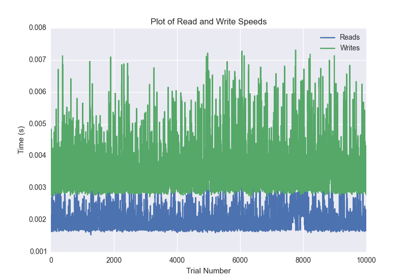
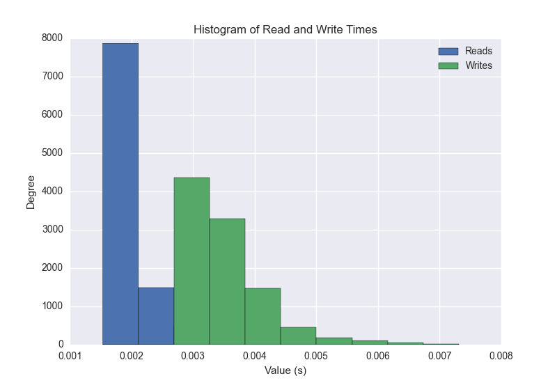
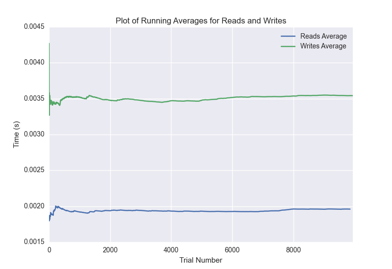

DATABASE BENCHMARKING REPORT - RIAK - 10000 Trials
=========================================

This report has been automatically generated from a Benchmarking application
built by [Kurtis Jungersen](http://kmjungersen.com).  The source behind the application can be found on the [project's GitHub.](https://github.com/kmjungersen/DB-Benchmarking)

TIME AND DATE
=============

Mon, 17 Nov, 2014 17:44:28

RESULTS
=======

After using these parameters:

| Parameter                  | Value   |
|:---------------------------|:--------|
| Database Tested            | RIAK    |
| Number of Trials           | 10000   |
| Length of Each Entry Field | 10      |
| Number of Nodes in Cluster | 3       |
| Split Reads and Writes     | True    |
| Debug Mode                 | False   |
| Chaos Mode (Random Reads)  | True    |

These results were obtained:

| Operation   |   Average |   St. Dev. |   Max Time |   Min Time |   Range |
|:------------|----------:|-----------:|-----------:|-----------:|--------:|
| Writes      |   0.00360 |    0.00126 |    0.05721 |    0.00273 | 0.05449 |
| Reads       |   0.00199 |    0.00045 |    0.01720 |    0.00154 | 0.01566 |

This plot shows the normalized speeds of reads and writes over the course of the benchmark.  The data was normalized (i.e. any data points beyond 3 standard deviations of the mean were excluded).

This plot shows a histogram which describes the general distribution of the data.

This plot shows the running averages for read and write speeds over the course of the benchmark.

Note: If any outliers were obtained in this benchmark, they will displayed here:

| Operation   |   Trial Number |      Value |
|:------------|---------------:|-----------:|
| Write       |              0 | 0.057215   |
| Write       |            355 | 0.0442441  |
| Write       |            356 | 0.0143781  |
| Write       |            365 | 0.00749493 |
| Write       |            372 | 0.00766993 |
| Write       |           1232 | 0.0121751  |
| Write       |           1286 | 0.00830793 |
| Write       |           1305 | 0.019598   |
| Write       |           2229 | 0.0123541  |
| Write       |           2230 | 0.016489   |
| Write       |           2231 | 0.015672   |
| Write       |           2232 | 0.021095   |
| Write       |           2233 | 0.011029   |
| Write       |           2240 | 0.00769496 |
| Write       |           2244 | 0.0104549  |
| Write       |           2326 | 0.016449   |
| Write       |           2400 | 0.00800204 |
| Write       |           2488 | 0.0077672  |
| Write       |           4926 | 0.0119779  |
| Write       |           4927 | 0.011539   |
| Write       |           4948 | 0.0171402  |
| Write       |           5273 | 0.0130289  |
| Write       |           5274 | 0.0229821  |
| Write       |           5516 | 0.0258138  |
| Write       |           5519 | 0.012892   |
| Write       |           5520 | 0.00769591 |
| Write       |           5522 | 0.00988007 |
| Write       |           5528 | 0.010632   |
| Write       |           5529 | 0.00781703 |
| Write       |           5555 | 0.0175209  |
| Write       |           5581 | 0.025394   |
| Write       |           5605 | 0.00786996 |
| Write       |           5654 | 0.00759387 |
| Write       |           5859 | 0.00769615 |
| Write       |           6120 | 0.00806284 |
| Write       |           6121 | 0.008497   |
| Write       |           6476 | 0.05094    |
| Write       |           6563 | 0.0131319  |
| Write       |           6567 | 0.012974   |
| Write       |           6580 | 0.00819278 |
| Write       |           6581 | 0.0088079  |
| Write       |           6636 | 0.00757194 |
| Write       |           6801 | 0.017271   |
| Write       |           7466 | 0.0074389  |
| Write       |           7699 | 0.00890708 |
| Write       |           8034 | 0.0103409  |
| Write       |           8132 | 0.0248511  |
| Write       |           8216 | 0.00807595 |
| Write       |           8218 | 0.00758505 |
| Write       |           8497 | 0.009058   |
| Write       |           8672 | 0.00750995 |
| Write       |           8775 | 0.00901294 |
| Write       |           8986 | 0.00800705 |
| Write       |           8987 | 0.0081861  |
| Write       |           8989 | 0.012532   |
| Write       |           9609 | 0.00766397 |
| Read        |              0 | 0.00644588 |
| Read        |            141 | 0.0171969  |
| Read        |            142 | 0.0114779  |
| Read        |            143 | 0.00367498 |
| Read        |            144 | 0.0053618  |
| Read        |            177 | 0.00458288 |
| Read        |            217 | 0.00353813 |
| Read        |            299 | 0.00373197 |
| Read        |            443 | 0.0035069  |
| Read        |            743 | 0.00395608 |
| Read        |            745 | 0.00333595 |
| Read        |            818 | 0.0035181  |
| Read        |            824 | 0.00342393 |
| Read        |           1275 | 0.00376511 |
| Read        |           1321 | 0.00397301 |
| Read        |           1347 | 0.00338197 |
| Read        |           1507 | 0.00394487 |
| Read        |           1517 | 0.00343204 |
| Read        |           1519 | 0.0040431  |
| Read        |           1523 | 0.00376105 |
| Read        |           1525 | 0.00407386 |
| Read        |           1760 | 0.00362992 |
| Read        |           1801 | 0.00343895 |
| Read        |           1841 | 0.00355411 |
| Read        |           1842 | 0.00423408 |
| Read        |           1843 | 0.00358105 |
| Read        |           1844 | 0.00334311 |
| Read        |           2052 | 0.00357795 |
| Read        |           2347 | 0.00371122 |
| Read        |           2348 | 0.0033772  |
| Read        |           2350 | 0.003438   |
| Read        |           2621 | 0.00391006 |
| Read        |           2794 | 0.004143   |
| Read        |           2864 | 0.0034349  |
| Read        |           3009 | 0.00422597 |
| Read        |           3302 | 0.00350404 |
| Read        |           3306 | 0.00347495 |
| Read        |           3308 | 0.00350499 |
| Read        |           3381 | 0.00450397 |
| Read        |           3399 | 0.00357604 |
| Read        |           3400 | 0.0040431  |
| Read        |           3401 | 0.00397611 |
| Read        |           3648 | 0.00423598 |
| Read        |           3649 | 0.0037148  |
| Read        |           3814 | 0.00347304 |
| Read        |           3815 | 0.00333405 |
| Read        |           3818 | 0.00396085 |
| Read        |           3896 | 0.00347209 |
| Read        |           3929 | 0.00374007 |
| Read        |           4337 | 0.00334096 |
| Read        |           4459 | 0.00366592 |
| Read        |           4462 | 0.00361395 |
| Read        |           4464 | 0.0035491  |
| Read        |           4856 | 0.00380683 |
| Read        |           5002 | 0.00377107 |
| Read        |           5536 | 0.0034368  |
| Read        |           5543 | 0.00357103 |
| Read        |           5544 | 0.00430393 |
| Read        |           5545 | 0.00361395 |
| Read        |           5549 | 0.00338507 |
| Read        |           6070 | 0.00352097 |
| Read        |           6077 | 0.00338817 |
| Read        |           6084 | 0.00359702 |
| Read        |           6614 | 0.00333595 |
| Read        |           6616 | 0.00333405 |
| Read        |           6624 | 0.00348711 |
| Read        |           6625 | 0.00334811 |
| Read        |           6629 | 0.00335002 |
| Read        |           6631 | 0.00400209 |
| Read        |           6931 | 0.0040381  |
| Read        |           6935 | 0.00409818 |
| Read        |           6936 | 0.003932   |
| Read        |           6937 | 0.0055449  |
| Read        |           6938 | 0.0048871  |
| Read        |           6939 | 0.00355411 |
| Read        |           6940 | 0.00861502 |
| Read        |           6941 | 0.00625396 |
| Read        |           6942 | 0.00500202 |
| Read        |           6943 | 0.00558996 |
| Read        |           6945 | 0.00374794 |
| Read        |           6946 | 0.00340605 |
| Read        |           6952 | 0.00358796 |
| Read        |           6953 | 0.00354791 |
| Read        |           6955 | 0.00349903 |
| Read        |           6957 | 0.00362206 |
| Read        |           6959 | 0.00380206 |
| Read        |           6960 | 0.00336385 |
| Read        |           6965 | 0.00400209 |
| Read        |           6983 | 0.00345206 |
| Read        |           6988 | 0.00384498 |
| Read        |           6989 | 0.00333881 |
| Read        |           7109 | 0.00335717 |
| Read        |           7111 | 0.00362206 |
| Read        |           7117 | 0.00426388 |
| Read        |           7128 | 0.0036149  |
| Read        |           7477 | 0.00364995 |
| Read        |           7478 | 0.00362396 |
| Read        |           7628 | 0.00335193 |
| Read        |           7634 | 0.00347114 |
| Read        |           7644 | 0.0036149  |
| Read        |           7651 | 0.00390291 |
| Read        |           7694 | 0.00370193 |
| Read        |           7701 | 0.00413203 |
| Read        |           7738 | 0.00397301 |
| Read        |           7739 | 0.004004   |
| Read        |           7842 | 0.00374603 |
| Read        |           7915 | 0.00346613 |
| Read        |           7916 | 0.00336194 |
| Read        |           7982 | 0.00350094 |
| Read        |           8074 | 0.00339198 |
| Read        |           8076 | 0.00341988 |
| Read        |           8084 | 0.00368595 |
| Read        |           8087 | 0.00361896 |
| Read        |           8093 | 0.00343513 |
| Read        |           8096 | 0.00357103 |
| Read        |           8138 | 0.00358295 |
| Read        |           8620 | 0.00338292 |
| Read        |           8629 | 0.00358582 |
| Read        |           8640 | 0.00335693 |
| Read        |           8643 | 0.00387096 |
| Read        |           8928 | 0.00968504 |
| Read        |           8929 | 0.00844312 |
| Read        |           8930 | 0.00346494 |
| Read        |           9164 | 0.00466204 |
| Read        |           9165 | 0.00484014 |
| Read        |           9172 | 0.00349402 |
| Read        |           9175 | 0.00415111 |
| Read        |           9177 | 0.00372982 |
| Read        |           9183 | 0.00335383 |
| Read        |           9184 | 0.00349307 |
| Read        |           9213 | 0.0041821  |
| Read        |           9219 | 0.00355601 |
| Read        |           9220 | 0.00410008 |
| Read        |           9227 | 0.00381899 |
| Read        |           9228 | 0.00380898 |
| Read        |           9704 | 0.00353003 |
| Read        |           9707 | 0.00396895 |
| Read        |           9716 | 0.00360513 |
| Read        |           9724 | 0.00336409 |
| Read        |           9727 | 0.00345397 |
| Read        |           9728 | 0.00357389 |
| Read        |           9731 | 0.00400114 |
| Read        |           9736 | 0.00377798 |
| Read        |           9737 | 0.00343204 |
| Read        |           9738 | 0.00391102 |
| Read        |           9827 | 0.004807   |