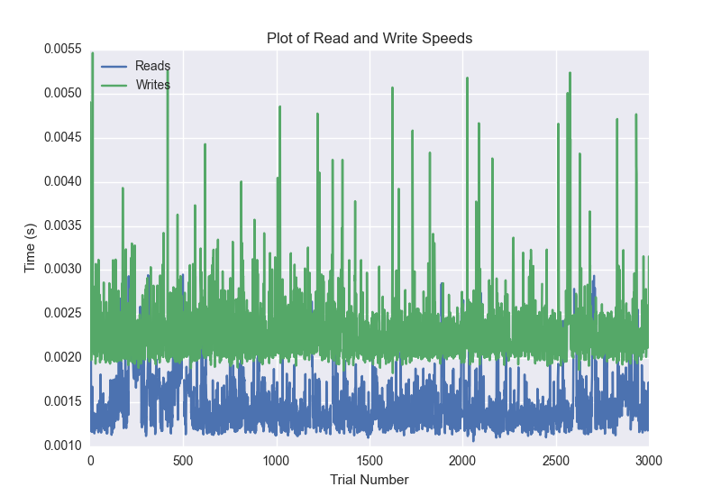
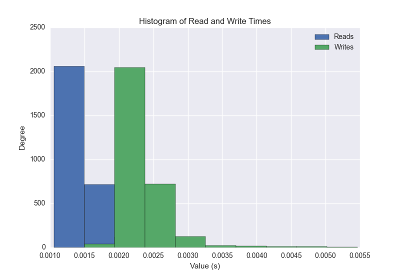
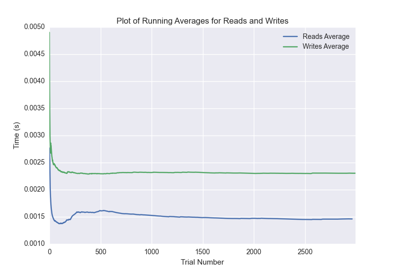

DATABASE BENCHMARKING REPORT - RIAK - 3000 Trials
=========================================

This report has been automatically generated from a Benchmarking application
built by [Kurtis Jungersen](http://kmjungersen.com).  The source behind the application can be found on the [project's GitHub.](https://github.com/kmjungersen/DB-Benchmarking)

TIME AND DATE
=============

Mon, 17 Nov, 2014 17:42:23

RESULTS
=======

After using these parameters:

| Parameter                  | Value   |
|:---------------------------|:--------|
| Database Tested            | RIAK    |
| Number of Trials           | 3000    |
| Length of Each Entry Field | 10      |
| Number of Nodes in Cluster | 3       |
| Split Reads and Writes     | True    |
| Debug Mode                 | False   |
| Chaos Mode (Random Reads)  | True    |

These results were obtained:

| Operation   |   Average |   St. Dev. |   Max Time |   Min Time |   Range |
|:------------|----------:|-----------:|-----------:|-----------:|--------:|
| Writes      |   0.00233 |    0.00108 |    0.05762 |    0.00183 | 0.05579 |
| Reads       |   0.00149 |    0.00049 |    0.01898 |    0.00106 | 0.01792 |

This plot shows the normalized speeds of reads and writes over the course of the benchmark.  The data was normalized (i.e. any data points beyond 3 standard deviations of the mean were excluded).

This plot shows a histogram which describes the general distribution of the data.

This plot shows the running averages for read and write speeds over the course of the benchmark.

Note: If any outliers were obtained in this benchmark, they will displayed here:

| Operation   |   Trial Number |      Value |
|:------------|---------------:|-----------:|
| Write       |              0 | 0.057621   |
| Write       |            216 | 0.00664401 |
| Write       |           2226 | 0.0056839  |
| Write       |           2427 | 0.00564718 |
| Write       |           2573 | 0.00574708 |
| Read        |              0 | 0.00581098 |
| Read        |            211 | 0.0189769  |
| Read        |            212 | 0.00426412 |
| Read        |            217 | 0.00514102 |
| Read        |            220 | 0.00315404 |
| Read        |            495 | 0.0038898  |
| Read        |            496 | 0.00364804 |
| Read        |            497 | 0.00356984 |
| Read        |            498 | 0.00350714 |
| Read        |            501 | 0.00347495 |
| Read        |            504 | 0.00321317 |
| Read        |            600 | 0.0040102  |
| Read        |            601 | 0.0036509  |
| Read        |            603 | 0.00307393 |
| Read        |           1183 | 0.00308299 |
| Read        |           1185 | 0.00297308 |
| Read        |           1187 | 0.00304413 |
| Read        |           1188 | 0.00399399 |
| Read        |           1190 | 0.00317287 |
| Read        |           1294 | 0.00311089 |
| Read        |           1297 | 0.00362897 |
| Read        |           1890 | 0.00295901 |
| Read        |           1892 | 0.00376606 |
| Read        |           1893 | 0.00374794 |
| Read        |           1894 | 0.00304103 |
| Read        |           1994 | 0.00300002 |
| Read        |           1997 | 0.00313807 |
| Read        |           2000 | 0.00297594 |
| Read        |           2001 | 0.00309491 |
| Read        |           2595 | 0.0032959  |
| Read        |           2597 | 0.00331712 |
| Read        |           2601 | 0.00301313 |
| Read        |           2602 | 0.00310802 |
| Read        |           2604 | 0.00308895 |
| Read        |           2605 | 0.00364494 |
| Read        |           2696 | 0.00342607 |
| Read        |           2697 | 0.00379896 |
| Read        |           2706 | 0.00321484 |