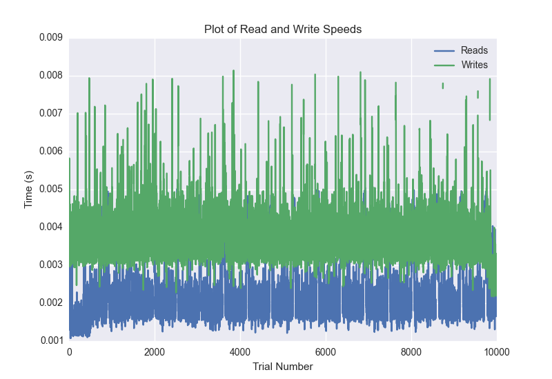
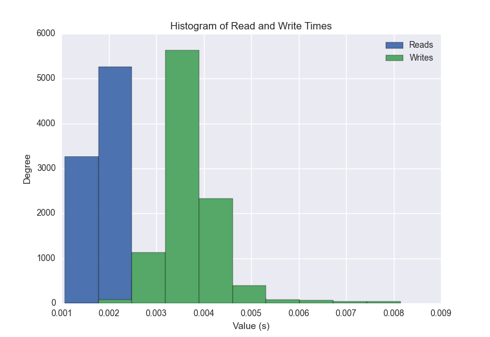
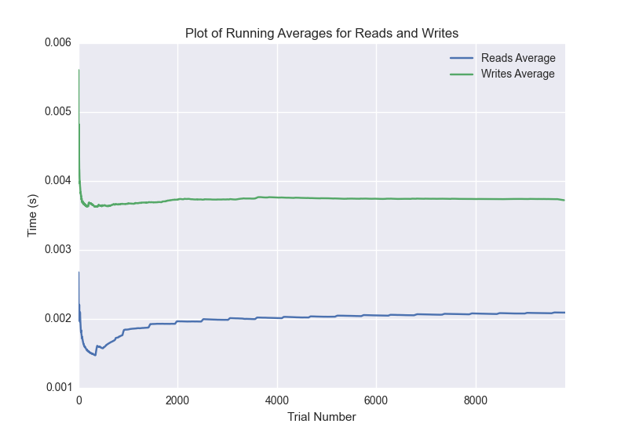

DATABASE BENCHMARKING REPORT - RIAK2
=========================================

This report has been automatically generated from a Benchmarking application
built by [Kurtis Jungersen](http://kmjungersen.com).  The source behind the application can be found on the [project's GitHub.](https://github.com/kmjungersen/DB-Benchmarking)

TIME AND DATE
=============

Fri, 14 Nov, 2014 17:19:42

RESULTS
=======

After using these parameters:

| Parameter                  | Value   |
|:---------------------------|:--------|
| Database Tested            | RIAK2   |
| Number of Trials           | 10000   |
| Length of Each Entry Field | 10      |
| Number of Nodes in Cluster | 3       |
| Split Reads and Writes     | True    |
| Debug Mode                 | False   |
| Chaos Mode (Random Reads)  | True    |

These results were obtained:

| Operation   |   Average |   St. Dev. |   Max Time |   Min Time |   Range |
|:------------|----------:|-----------:|-----------:|-----------:|--------:|
| Writes      |   0.00387 |    0.00143 |    0.06937 |    0.00217 | 0.06720 |
| Reads       |   0.00217 |    0.00096 |    0.04364 |    0.00108 | 0.04256 |

This plot shows the normalized speeds of reads and writes over the course of the benchmark.  The data was normalized (i.e. any data points beyond 3 standard deviations of the mean were excluded).

This plot shows a histogram which describes the general distribution of the data.

This plot shows the running averages for read and write speeds over the course of the benchmark.

Note: If any outliers were obtained in this benchmark, they will displayed here:

| Operation   |   Trial Number |      Value |
|:------------|---------------:|-----------:|
| Write       |              0 | 0.036222   |
| Write       |            739 | 0.008178   |
| Write       |           1004 | 0.00980282 |
| Write       |           1005 | 0.00868797 |
| Write       |           1267 | 0.00968409 |
| Write       |           1318 | 0.0693731  |
| Write       |           1513 | 0.00822401 |
| Write       |           1514 | 0.00892615 |
| Write       |           1695 | 0.00875306 |
| Write       |           1772 | 0.00943804 |
| Write       |           1808 | 0.009444   |
| Write       |           2021 | 0.00985718 |
| Write       |           2022 | 0.0139351  |
| Write       |           2023 | 0.0100791  |
| Write       |           2282 | 0.0090909  |
| Write       |           2283 | 0.00979805 |
| Write       |           2284 | 0.0107758  |
| Write       |           2285 | 0.00825906 |
| Write       |           2549 | 0.00894499 |
| Write       |           2550 | 0.0102611  |
| Write       |           2551 | 0.00832701 |
| Write       |           2552 | 0.00988102 |
| Write       |           2814 | 0.0110998  |
| Write       |           2815 | 0.00820208 |
| Write       |           2816 | 0.0100281  |
| Write       |           2817 | 0.00843    |
| Write       |           3076 | 0.00827909 |
| Write       |           3077 | 0.0105588  |
| Write       |           3078 | 0.0132298  |
| Write       |           3079 | 0.0105851  |
| Write       |           3335 | 0.00932503 |
| Write       |           3336 | 0.00895786 |
| Write       |           3337 | 0.0103621  |
| Write       |           3338 | 0.00885892 |
| Write       |           3599 | 0.00899792 |
| Write       |           3600 | 0.010294   |
| Write       |           3601 | 0.00900698 |
| Write       |           3617 | 0.00884795 |
| Write       |           3618 | 0.0104349  |
| Write       |           3638 | 0.00887704 |
| Write       |           3850 | 0.00959301 |
| Write       |           3851 | 0.0118959  |
| Write       |           4116 | 0.00979781 |
| Write       |           4118 | 0.00857592 |
| Write       |           4119 | 0.0100751  |
| Write       |           4120 | 0.00944209 |
| Write       |           4121 | 0.00869918 |
| Write       |           4388 | 0.00963092 |
| Write       |           4390 | 0.00863695 |
| Write       |           4391 | 0.0101061  |
| Write       |           4393 | 0.00863504 |
| Write       |           4658 | 0.010581   |
| Write       |           4660 | 0.00891209 |
| Write       |           4661 | 0.0132     |
| Write       |           4662 | 0.00912499 |
| Write       |           4663 | 0.00886297 |
| Write       |           4932 | 0.010294   |
| Write       |           4933 | 0.00878787 |
| Write       |           4934 | 0.00871897 |
| Write       |           4935 | 0.0107849  |
| Write       |           4937 | 0.0087409  |
| Write       |           5204 | 0.00889206 |
| Write       |           5206 | 0.00968289 |
| Write       |           5207 | 0.0104148  |
| Write       |           5208 | 0.013694   |
| Write       |           5209 | 0.0101111  |
| Write       |           5477 | 0.00995111 |
| Write       |           5479 | 0.00907803 |
| Write       |           5480 | 0.0101991  |
| Write       |           5481 | 0.00981712 |
| Write       |           5482 | 0.00841403 |
| Write       |           5483 | 0.00912619 |
| Write       |           5746 | 0.0108979  |
| Write       |           5747 | 0.014266   |
| Write       |           5748 | 0.00995207 |
| Write       |           5749 | 0.00921416 |
| Write       |           5750 | 0.0129459  |
| Write       |           5752 | 0.00884795 |
| Write       |           6017 | 0.00834894 |
| Write       |           6018 | 0.00937009 |
| Write       |           6020 | 0.00949121 |
| Write       |           6021 | 0.0110221  |
| Write       |           6022 | 0.00950384 |
| Write       |           6023 | 0.00822282 |
| Write       |           6024 | 0.00908685 |
| Write       |           6025 | 0.00882888 |
| Write       |           6224 | 0.0129502  |
| Write       |           6242 | 0.00824594 |
| Write       |           6286 | 0.00929403 |
| Write       |           6288 | 0.00927496 |
| Write       |           6289 | 0.00865197 |
| Write       |           6290 | 0.0117888  |
| Write       |           6291 | 0.00987387 |
| Write       |           6293 | 0.00823402 |
| Write       |           6366 | 0.02054    |
| Write       |           6476 | 0.0537171  |
| Write       |           6541 | 0.00963593 |
| Write       |           6542 | 0.00957584 |
| Write       |           6543 | 0.00843215 |
| Write       |           6544 | 0.008605   |
| Write       |           6545 | 0.011349   |
| Write       |           6546 | 0.0102131  |
| Write       |           6548 | 0.00883603 |
| Write       |           6549 | 0.00902605 |
| Write       |           6811 | 0.00852299 |
| Write       |           6812 | 0.00927591 |
| Write       |           6815 | 0.00957179 |
| Write       |           6816 | 0.0104158  |
| Write       |           6818 | 0.00887418 |
| Write       |           6819 | 0.00861692 |
| Write       |           7083 | 0.00989699 |
| Write       |           7085 | 0.00880909 |
| Write       |           7086 | 0.0101399  |
| Write       |           7087 | 0.00965285 |
| Write       |           7088 | 0.00994515 |
| Write       |           7090 | 0.00857282 |
| Write       |           7091 | 0.00830197 |
| Write       |           7356 | 0.0112469  |
| Write       |           7357 | 0.00959992 |
| Write       |           7359 | 0.00929999 |
| Write       |           7360 | 0.00884604 |
| Write       |           7361 | 0.00967717 |
| Write       |           7362 | 0.0112679  |
| Write       |           7364 | 0.00923491 |
| Write       |           7365 | 0.00875998 |
| Write       |           7631 | 0.00883508 |
| Write       |           7632 | 0.011698   |
| Write       |           7634 | 0.0104229  |
| Write       |           7635 | 0.00880599 |
| Write       |           7636 | 0.010941   |
| Write       |           7637 | 0.01193    |
| Write       |           7640 | 0.00900817 |
| Write       |           7907 | 0.00975895 |
| Write       |           7908 | 0.011709   |
| Write       |           7910 | 0.0086     |
| Write       |           7911 | 0.009022   |
| Write       |           7912 | 0.0102191  |
| Write       |           7913 | 0.0131428  |
| Write       |           7914 | 0.00837207 |
| Write       |           7916 | 0.00827503 |
| Write       |           7917 | 0.010294   |
| Write       |           8072 | 0.0171089  |
| Write       |           8180 | 0.0111029  |
| Write       |           8181 | 0.00997305 |
| Write       |           8183 | 0.0105832  |
| Write       |           8184 | 0.00820708 |
| Write       |           8185 | 0.011538   |
| Write       |           8186 | 0.0105779  |
| Write       |           8187 | 0.00909591 |
| Write       |           8188 | 0.0101831  |
| Write       |           8189 | 0.00909686 |
| Write       |           8190 | 0.00834799 |
| Write       |           8451 | 0.012569   |
| Write       |           8452 | 0.011297   |
| Write       |           8454 | 0.00998712 |
| Write       |           8455 | 0.00949287 |
| Write       |           8456 | 0.0102201  |
| Write       |           8457 | 0.0126061  |
| Write       |           8458 | 0.00868797 |
| Write       |           8459 | 0.00846004 |
| Write       |           8460 | 0.00882006 |
| Write       |           8461 | 0.00878501 |
| Write       |           8729 | 0.008883   |
| Write       |           8730 | 0.0102401  |
| Write       |           8731 | 0.00913191 |
| Write       |           8733 | 0.01406    |
| Write       |           8734 | 0.00854421 |
| Write       |           8735 | 0.00940704 |
| Write       |           8736 | 0.012058   |
| Write       |           8737 | 0.0206859  |
| Write       |           8738 | 0.0123191  |
| Write       |           8741 | 0.00835705 |
| Write       |           9000 | 0.00828981 |
| Write       |           9001 | 0.01086    |
| Write       |           9002 | 0.00922298 |
| Write       |           9004 | 0.00917888 |
| Write       |           9006 | 0.00926709 |
| Write       |           9007 | 0.00959921 |
| Write       |           9008 | 0.0087111  |
| Write       |           9010 | 0.00909185 |
| Write       |           9011 | 0.00892711 |
| Write       |           9012 | 0.0102739  |
| Write       |           9052 | 0.0120471  |
| Write       |           9276 | 0.010452   |
| Write       |           9277 | 0.0101211  |
| Write       |           9279 | 0.00998306 |
| Write       |           9280 | 0.00917387 |
| Write       |           9281 | 0.0100491  |
| Write       |           9282 | 0.00991297 |
| Write       |           9283 | 0.010747   |
| Write       |           9285 | 0.00818801 |
| Write       |           9286 | 0.0086689  |
| Write       |           9287 | 0.00925708 |
| Write       |           9556 | 0.0104642  |
| Write       |           9559 | 0.00955296 |
| Write       |           9560 | 0.00870705 |
| Write       |           9561 | 0.0100861  |
| Write       |           9562 | 0.0107851  |
| Write       |           9563 | 0.013324   |
| Write       |           9565 | 0.00935698 |
| Write       |           9566 | 0.00815701 |
| Write       |           9567 | 0.00868797 |
| Write       |           9568 | 0.00815296 |
| Write       |           9577 | 0.00857306 |
| Write       |           9835 | 0.0105941  |
| Write       |           9836 | 0.010402   |
| Write       |           9839 | 0.0109441  |
| Write       |           9840 | 0.00941491 |
| Write       |           9841 | 0.0106051  |
| Write       |           9842 | 0.00921202 |
| Write       |           9843 | 0.0138559  |
| Write       |           9845 | 0.0090909  |
| Write       |           9846 | 0.0102761  |
| Write       |           9847 | 0.016005   |
| Write       |           9848 | 0.00942111 |
| Read        |              0 | 0.043638   |
| Read        |            348 | 0.00531292 |
| Read        |            744 | 0.00529909 |
| Read        |            749 | 0.00534606 |
| Read        |            891 | 0.00545096 |
| Read        |            892 | 0.00537682 |
| Read        |            893 | 0.006212   |
| Read        |            894 | 0.00834799 |
| Read        |            899 | 0.00555015 |
| Read        |            900 | 0.00550699 |
| Read        |            905 | 0.0051868  |
| Read        |            908 | 0.00532103 |
| Read        |            912 | 0.008219   |
| Read        |            919 | 0.00531411 |
| Read        |           1427 | 0.00532913 |
| Read        |           1429 | 0.00504804 |
| Read        |           1430 | 0.00678301 |
| Read        |           1448 | 0.00607896 |
| Read        |           1451 | 0.00676703 |
| Read        |           1966 | 0.005126   |
| Read        |           1969 | 0.00605202 |
| Read        |           1974 | 0.00531507 |
| Read        |           1975 | 0.00516415 |
| Read        |           1985 | 0.00566506 |
| Read        |           1991 | 0.00528812 |
| Read        |           1992 | 0.00593185 |
| Read        |           2010 | 0.00525808 |
| Read        |           2505 | 0.006459   |
| Read        |           2522 | 0.00520515 |
| Read        |           2526 | 0.00511217 |
| Read        |           2530 | 0.0069952  |
| Read        |           2550 | 0.00518417 |
| Read        |           3048 | 0.00583196 |
| Read        |           3057 | 0.00513005 |
| Read        |           3074 | 0.00613904 |
| Read        |           3080 | 0.0050571  |
| Read        |           3090 | 0.00552106 |
| Read        |           3598 | 0.00512886 |
| Read        |           3601 | 0.00664401 |
| Read        |           3617 | 0.00578022 |
| Read        |           3619 | 0.00598311 |
| Read        |           3620 | 0.00574279 |
| Read        |           3624 | 0.00528312 |
| Read        |           3627 | 0.00586605 |
| Read        |           3630 | 0.006001   |
| Read        |           3641 | 0.00517678 |
| Read        |           3642 | 0.00540519 |
| Read        |           4146 | 0.00585198 |
| Read        |           4148 | 0.00629997 |
| Read        |           4149 | 0.00610805 |
| Read        |           4154 | 0.00527287 |
| Read        |           4163 | 0.00616908 |
| Read        |           4171 | 0.00513315 |
| Read        |           4178 | 0.00531507 |
| Read        |           4179 | 0.00632501 |
| Read        |           4180 | 0.00675607 |
| Read        |           4190 | 0.0050931  |
| Read        |           4695 | 0.00580716 |
| Read        |           4698 | 0.00614095 |
| Read        |           4705 | 0.00524688 |
| Read        |           4709 | 0.00578785 |
| Read        |           4710 | 0.00574899 |
| Read        |           4716 | 0.00534916 |
| Read        |           4719 | 0.00514293 |
| Read        |           4720 | 0.00510907 |
| Read        |           4728 | 0.00536895 |
| Read        |           4729 | 0.00605392 |
| Read        |           4730 | 0.00524402 |
| Read        |           4731 | 0.00513291 |
| Read        |           4732 | 0.00557899 |
| Read        |           5239 | 0.00516605 |
| Read        |           5242 | 0.00630999 |
| Read        |           5261 | 0.00513911 |
| Read        |           5264 | 0.00516605 |
| Read        |           5265 | 0.00584793 |
| Read        |           5266 | 0.00549102 |
| Read        |           5274 | 0.00513697 |
| Read        |           5277 | 0.00671506 |
| Read        |           5335 | 0.00799394 |
| Read        |           5337 | 0.00794911 |
| Read        |           5783 | 0.0056951  |
| Read        |           5784 | 0.00595307 |
| Read        |           5797 | 0.00520086 |
| Read        |           5800 | 0.00511694 |
| Read        |           5802 | 0.00610399 |
| Read        |           5804 | 0.00513005 |
| Read        |           5809 | 0.00780296 |
| Read        |           5820 | 0.00532794 |
| Read        |           5821 | 0.00547099 |
| Read        |           5822 | 0.00535798 |
| Read        |           5823 | 0.006284   |
| Read        |           5828 | 0.00507593 |
| Read        |           5836 | 0.00523996 |
| Read        |           6339 | 0.00551796 |
| Read        |           6341 | 0.00711417 |
| Read        |           6351 | 0.00634599 |
| Read        |           6352 | 0.00552392 |
| Read        |           6353 | 0.00517106 |
| Read        |           6354 | 0.0054009  |
| Read        |           6360 | 0.00543809 |
| Read        |           6361 | 0.00546408 |
| Read        |           6362 | 0.00512815 |
| Read        |           6363 | 0.00536203 |
| Read        |           6365 | 0.00628996 |
| Read        |           6366 | 0.00604606 |
| Read        |           6367 | 0.00514603 |
| Read        |           6368 | 0.00595021 |
| Read        |           6370 | 0.00595617 |
| Read        |           6371 | 0.00534701 |
| Read        |           6378 | 0.00507188 |
| Read        |           6379 | 0.00560093 |
| Read        |           6380 | 0.00518203 |
| Read        |           6381 | 0.00695395 |
| Read        |           6383 | 0.00513005 |
| Read        |           6397 | 0.00519681 |
| Read        |           6717 | 0.00743794 |
| Read        |           6719 | 0.0125411  |
| Read        |           6720 | 0.00670314 |
| Read        |           6883 | 0.00515103 |
| Read        |           6885 | 0.00524092 |
| Read        |           6929 | 0.00769091 |
| Read        |           7444 | 0.00509906 |
| Read        |           7445 | 0.00517893 |
| Read        |           7446 | 0.00650597 |
| Read        |           7447 | 0.00572896 |
| Read        |           7453 | 0.00575304 |
| Read        |           7460 | 0.00548983 |
| Read        |           7461 | 0.00509381 |
| Read        |           7473 | 0.0052321  |
| Read        |           7477 | 0.00614381 |
| Read        |           7479 | 0.00549603 |
| Read        |           7490 | 0.00544    |
| Read        |           7493 | 0.00645304 |
| Read        |           8008 | 0.00523996 |
| Read        |           8010 | 0.00647712 |
| Read        |           8023 | 0.00521708 |
| Read        |           8024 | 0.00564003 |
| Read        |           8031 | 0.005512   |
| Read        |           8032 | 0.0057261  |
| Read        |           8033 | 0.00896811 |
| Read        |           8042 | 0.0050838  |
| Read        |           8043 | 0.00529099 |
| Read        |           8056 | 0.00597596 |
| Read        |           8057 | 0.00623202 |
| Read        |           8062 | 0.00541186 |
| Read        |           8576 | 0.00557804 |
| Read        |           8577 | 0.00519609 |
| Read        |           8579 | 0.00599003 |
| Read        |           8580 | 0.00597692 |
| Read        |           8594 | 0.00641584 |
| Read        |           8601 | 0.00660801 |
| Read        |           8604 | 0.00609279 |
| Read        |           8609 | 0.005229   |
| Read        |           8611 | 0.00587082 |
| Read        |           8614 | 0.00799799 |
| Read        |           8615 | 0.00515103 |
| Read        |           8627 | 0.00513697 |
| Read        |           8628 | 0.00556898 |
| Read        |           9147 | 0.00647688 |
| Read        |           9151 | 0.00547194 |
| Read        |           9157 | 0.00533009 |
| Read        |           9158 | 0.00556207 |
| Read        |           9160 | 0.00648904 |
| Read        |           9167 | 0.00527096 |
| Read        |           9171 | 0.00526094 |
| Read        |           9173 | 0.00512791 |
| Read        |           9181 | 0.00658202 |
| Read        |           9189 | 0.00518918 |
| Read        |           9193 | 0.00543618 |
| Read        |           9196 | 0.006495   |
| Read        |           9704 | 0.00623584 |
| Read        |           9705 | 0.00549698 |
| Read        |           9707 | 0.00619912 |
| Read        |           9713 | 0.00554919 |
| Read        |           9723 | 0.00600195 |
| Read        |           9732 | 0.00609899 |
| Read        |           9734 | 0.00676489 |
| Read        |           9738 | 0.00530481 |
| Read        |           9743 | 0.0051198  |
| Read        |           9747 | 0.00726509 |
| Read        |           9760 | 0.00593185 |
| Read        |           9762 | 0.00504589 |
| Read        |           9763 | 0.00533104 |
| Read        |           9774 | 0.00561595 |
| Read        |           9775 | 0.00777698 |
| Read        |           9776 | 0.00626302 |
| Read        |           9777 | 0.010319   |
| Read        |           9956 | 0.013962   |
| Read        |           9957 | 0.0152738  |
| Read        |           9958 | 0.010303   |
| Read        |           9959 | 0.00733995 |