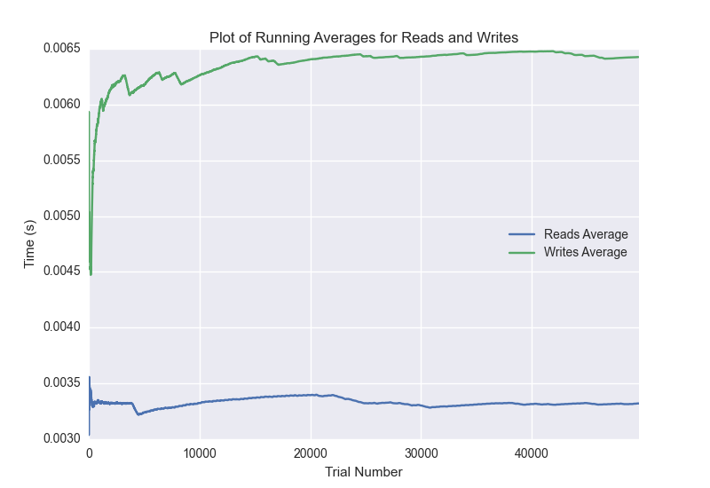

DATABASE BENCHMARKING REPORT - RIAK2
=========================================

This report has been automatically generated from a Benchmarking application
built by [Kurtis Jungersen](http://kmjungersen.com).  The source behind the application can be found on the [project's GitHub.](https://github.com/kmjungersen/DB-Benchmarking)

TIME AND DATE
=============

Fri, 14 Nov, 2014 17:27:40

RESULTS
=======

After using these parameters:

| Parameter                  | Value   |
|:---------------------------|:--------|
| Database Tested            | RIAK2   |
| Number of Trials           | 50000   |
| Length of Each Entry Field | 10      |
| Number of Nodes in Cluster | 3       |
| Split Reads and Writes     | True    |
| Debug Mode                 | False   |
| Chaos Mode (Random Reads)  | True    |

These results were obtained:

| Operation   |   Average |   St. Dev. |   Max Time |   Min Time |   Range |
|:------------|----------:|-----------:|-----------:|-----------:|--------:|
| Writes      |   0.00651 |    0.00213 |    0.17226 |    0.00311 | 0.16914 |
| Reads       |   0.00337 |    0.00136 |    0.10766 |    0.00163 | 0.10603 |

This plot shows the normalized speeds of reads and writes over the course of the benchmark.  The data was normalized (i.e. any data points beyond 3 standard deviations of the mean were excluded).

This plot shows a histogram which describes the general distribution of the data.

This plot shows the running averages for read and write speeds over the course of the benchmark.

Note: If any outliers were obtained in this benchmark, they will displayed here:

| Operation   |   Trial Number |      Value |
|:------------|---------------:|-----------:|
| Write       |              0 | 0.0198581  |
| Write       |            356 | 0.104931   |
| Write       |           1134 | 0.015239   |
| Write       |           1186 | 0.0500479  |
| Write       |           2436 | 0.0130579  |
| Write       |           2555 | 0.013139   |
| Write       |           2678 | 0.016679   |
| Write       |           2843 | 0.013155   |
| Write       |           3078 | 0.013222   |
| Write       |           3093 | 0.0130641  |
| Write       |           3348 | 0.0141871  |
| Write       |           3747 | 0.0168009  |
| Write       |           3900 | 0.0211859  |
| Write       |           3901 | 0.032057   |
| Write       |           4115 | 0.0171919  |
| Write       |           4118 | 0.022409   |
| Write       |           4220 | 0.0208108  |
| Write       |           4539 | 0.0134661  |
| Write       |           4648 | 0.020932   |
| Write       |           4650 | 0.026546   |
| Write       |           4651 | 0.0195379  |
| Write       |           4652 | 0.015574   |
| Write       |           4673 | 0.03462    |
| Write       |           4734 | 0.0229969  |
| Write       |           4990 | 0.0144229  |
| Write       |           5008 | 0.0158389  |
| Write       |           5143 | 0.013973   |
| Write       |           5289 | 0.015728   |
| Write       |           5433 | 0.0132041  |
| Write       |           5655 | 0.0227649  |
| Write       |           5744 | 0.0129499  |
| Write       |           6236 | 0.0134881  |
| Write       |           6403 | 0.0130808  |
| Write       |           6476 | 0.052629   |
| Write       |           7017 | 0.013607   |
| Write       |           7537 | 0.0129552  |
| Write       |           7778 | 0.017241   |
| Write       |           7797 | 0.020355   |
| Write       |           7801 | 0.0168891  |
| Write       |           7806 | 0.0132971  |
| Write       |           7848 | 0.0294611  |
| Write       |           8056 | 0.013716   |
| Write       |           8380 | 0.0129051  |
| Write       |           8381 | 0.01333    |
| Write       |           8536 | 0.0132282  |
| Write       |           8621 | 0.01352    |
| Write       |           8622 | 0.0136249  |
| Write       |           9258 | 0.0150731  |
| Write       |           9259 | 0.0179708  |
| Write       |           9260 | 0.0143111  |
| Write       |           9650 | 0.013499   |
| Write       |           9753 | 0.0134449  |
| Write       |          10055 | 0.0135489  |
| Write       |          10203 | 0.0151341  |
| Write       |          10204 | 0.0141051  |
| Write       |          10359 | 0.01776    |
| Write       |          10360 | 0.014905   |
| Write       |          10362 | 0.0130582  |
| Write       |          10821 | 0.0133309  |
| Write       |          10842 | 0.0131509  |
| Write       |          10968 | 0.0130351  |
| Write       |          10997 | 0.0131621  |
| Write       |          11123 | 0.0150299  |
| Write       |          11158 | 0.0134058  |
| Write       |          11268 | 0.0131948  |
| Write       |          11306 | 0.0130041  |
| Write       |          11310 | 0.0138152  |
| Write       |          11465 | 0.0151548  |
| Write       |          11466 | 0.013598   |
| Write       |          11467 | 0.0160861  |
| Write       |          11568 | 0.0140538  |
| Write       |          11622 | 0.0132601  |
| Write       |          11783 | 0.0136921  |
| Write       |          11784 | 0.0132759  |
| Write       |          11871 | 0.014852   |
| Write       |          11936 | 0.013375   |
| Write       |          12018 | 0.01351    |
| Write       |          12089 | 0.015476   |
| Write       |          12241 | 0.0148821  |
| Write       |          12310 | 0.012897   |
| Write       |          12394 | 0.0138001  |
| Write       |          12397 | 0.0138481  |
| Write       |          12475 | 0.020267   |
| Write       |          12550 | 0.013819   |
| Write       |          12551 | 0.0130029  |
| Write       |          12605 | 0.013334   |
| Write       |          12707 | 0.0133531  |
| Write       |          12897 | 0.014019   |
| Write       |          12898 | 0.013088   |
| Write       |          13007 | 0.0129011  |
| Write       |          13010 | 0.013937   |
| Write       |          13011 | 0.0131788  |
| Write       |          13167 | 0.014019   |
| Write       |          13170 | 0.0133219  |
| Write       |          13327 | 0.012886   |
| Write       |          13553 | 0.0131221  |
| Write       |          13651 | 0.013984   |
| Write       |          13806 | 0.0148242  |
| Write       |          13807 | 0.014231   |
| Write       |          13987 | 0.016083   |
| Write       |          14247 | 0.013989   |
| Write       |          14249 | 0.0139952  |
| Write       |          14268 | 0.0137062  |
| Write       |          14417 | 0.0134931  |
| Write       |          14568 | 0.013108   |
| Write       |          14572 | 0.0149519  |
| Write       |          14687 | 0.0141549  |
| Write       |          14991 | 0.0136471  |
| Write       |          15037 | 0.0137329  |
| Write       |          15040 | 0.012991   |
| Write       |          15197 | 0.013592   |
| Write       |          15348 | 0.0172     |
| Write       |          15350 | 0.0138721  |
| Write       |          15669 | 0.0136161  |
| Write       |          15738 | 0.0141201  |
| Write       |          15781 | 0.0130942  |
| Write       |          15815 | 0.013386   |
| Write       |          15968 | 0.0135109  |
| Write       |          16060 | 0.0175891  |
| Write       |          16755 | 0.0132849  |
| Write       |          16779 | 0.0265379  |
| Write       |          16780 | 0.0281     |
| Write       |          17333 | 0.01389    |
| Write       |          17496 | 0.0141349  |
| Write       |          17657 | 0.0144081  |
| Write       |          17667 | 0.0141399  |
| Write       |          17817 | 0.0138221  |
| Write       |          17971 | 0.017158   |
| Write       |          18127 | 0.0188179  |
| Write       |          18129 | 0.013685   |
| Write       |          18130 | 0.0161409  |
| Write       |          18131 | 0.013309   |
| Write       |          18132 | 0.0169392  |
| Write       |          18589 | 0.014333   |
| Write       |          18614 | 0.024235   |
| Write       |          18737 | 0.0146282  |
| Write       |          18794 | 0.0142431  |
| Write       |          18795 | 0.01353    |
| Write       |          18882 | 0.0133159  |
| Write       |          18917 | 0.0129099  |
| Write       |          19073 | 0.013139   |
| Write       |          19177 | 0.013242   |
| Write       |          19224 | 0.0138502  |
| Write       |          19301 | 0.0132601  |
| Write       |          19327 | 0.0143812  |
| Write       |          19383 | 0.0129371  |
| Write       |          19480 | 0.0131309  |
| Write       |          19542 | 0.014529   |
| Write       |          19852 | 0.0138459  |
| Write       |          19855 | 0.0135031  |
| Write       |          20168 | 0.015516   |
| Write       |          20234 | 0.0136738  |
| Write       |          20262 | 0.014528   |
| Write       |          20326 | 0.0131369  |
| Write       |          20385 | 0.0132329  |
| Write       |          20482 | 0.013279   |
| Write       |          20486 | 0.0129819  |
| Write       |          20537 | 0.015003   |
| Write       |          20541 | 0.0136058  |
| Write       |          20642 | 0.013586   |
| Write       |          20693 | 0.0130079  |
| Write       |          20798 | 0.0133369  |
| Write       |          20800 | 0.016058   |
| Write       |          20802 | 0.01354    |
| Write       |          21364 | 0.0159812  |
| Write       |          21426 | 0.012928   |
| Write       |          21427 | 0.0130911  |
| Write       |          21428 | 0.0136509  |
| Write       |          21593 | 0.0135071  |
| Write       |          21747 | 0.0278912  |
| Write       |          21748 | 0.0155032  |
| Write       |          21750 | 0.017005   |
| Write       |          21903 | 0.01354    |
| Write       |          21904 | 0.0151429  |
| Write       |          21905 | 0.0190039  |
| Write       |          21906 | 0.014348   |
| Write       |          22057 | 0.020906   |
| Write       |          22058 | 0.0135071  |
| Write       |          22370 | 0.0133989  |
| Write       |          22374 | 0.0134189  |
| Write       |          22454 | 0.013658   |
| Write       |          22529 | 0.014118   |
| Write       |          22692 | 0.0132749  |
| Write       |          22920 | 0.0142159  |
| Write       |          22983 | 0.0152781  |
| Write       |          23166 | 0.0149682  |
| Write       |          23169 | 0.0143051  |
| Write       |          23275 | 0.016084   |
| Write       |          23330 | 0.0131042  |
| Write       |          23800 | 0.013927   |
| Write       |          24192 | 0.014787   |
| Write       |          24193 | 0.022279   |
| Write       |          24194 | 0.05       |
| Write       |          24249 | 0.0210841  |
| Write       |          24264 | 0.013392   |
| Write       |          25136 | 0.0154018  |
| Write       |          25392 | 0.013555   |
| Write       |          25443 | 0.0163569  |
| Write       |          25445 | 0.017575   |
| Write       |          25446 | 0.017612   |
| Write       |          25450 | 0.013351   |
| Write       |          25453 | 0.014411   |
| Write       |          26009 | 0.014149   |
| Write       |          26165 | 0.014327   |
| Write       |          26166 | 0.0212011  |
| Write       |          26321 | 0.0167141  |
| Write       |          26478 | 0.015914   |
| Write       |          26989 | 0.0131822  |
| Write       |          27125 | 0.0132139  |
| Write       |          27284 | 0.013401   |
| Write       |          27441 | 0.0145211  |
| Write       |          27558 | 0.0152121  |
| Write       |          27852 | 0.014812   |
| Write       |          27915 | 0.0131791  |
| Write       |          28031 | 0.018611   |
| Write       |          28337 | 0.0182631  |
| Write       |          28462 | 0.0135701  |
| Write       |          28646 | 0.0182641  |
| Write       |          28844 | 0.0136209  |
| Write       |          29106 | 0.0129461  |
| Write       |          29269 | 0.0181401  |
| Write       |          29310 | 0.0131831  |
| Write       |          29775 | 0.0167551  |
| Write       |          29906 | 0.0137882  |
| Write       |          29907 | 0.0140331  |
| Write       |          29910 | 0.0136659  |
| Write       |          30068 | 0.0162201  |
| Write       |          30228 | 0.0176649  |
| Write       |          30352 | 0.017684   |
| Write       |          30382 | 0.0152111  |
| Write       |          30383 | 0.0200601  |
| Write       |          30540 | 0.0140281  |
| Write       |          30843 | 0.0129719  |
| Write       |          31021 | 0.0130339  |
| Write       |          31176 | 0.0130651  |
| Write       |          31292 | 0.0147128  |
| Write       |          31323 | 0.0129409  |
| Write       |          31327 | 0.015178   |
| Write       |          31329 | 0.0603039  |
| Write       |          31438 | 0.0136502  |
| Write       |          31440 | 0.013103   |
| Write       |          31590 | 0.013128   |
| Write       |          31639 | 0.0129251  |
| Write       |          31643 | 0.0134909  |
| Write       |          31650 | 0.013823   |
| Write       |          31651 | 0.0137351  |
| Write       |          31662 | 0.017971   |
| Write       |          32032 | 0.01438    |
| Write       |          32094 | 0.016175   |
| Write       |          32545 | 0.172256   |
| Write       |          32626 | 0.0134382  |
| Write       |          32689 | 0.0145829  |
| Write       |          32691 | 0.0136349  |
| Write       |          32928 | 0.0154541  |
| Write       |          33387 | 0.01583    |
| Write       |          33558 | 0.0169821  |
| Write       |          33807 | 0.013185   |
| Write       |          33809 | 0.016089   |
| Write       |          33810 | 0.0133591  |
| Write       |          33811 | 0.0130799  |
| Write       |          34087 | 0.0185702  |
| Write       |          34367 | 0.01525    |
| Write       |          34368 | 0.0156209  |
| Write       |          34527 | 0.0161211  |
| Write       |          34687 | 0.013519   |
| Write       |          34745 | 0.0154371  |
| Write       |          34849 | 0.013165   |
| Write       |          34985 | 0.0132091  |
| Write       |          35439 | 0.0141659  |
| Write       |          35471 | 0.0132411  |
| Write       |          35621 | 0.0141511  |
| Write       |          35724 | 0.0128989  |
| Write       |          35780 | 0.0138249  |
| Write       |          35815 | 0.0144351  |
| Write       |          35823 | 0.0134959  |
| Write       |          35858 | 0.0185192  |
| Write       |          35859 | 0.0140131  |
| Write       |          35870 | 0.013489   |
| Write       |          35894 | 0.013062   |
| Write       |          35919 | 0.0155642  |
| Write       |          35929 | 0.024194   |
| Write       |          35960 | 0.0180058  |
| Write       |          35961 | 0.0144289  |
| Write       |          35962 | 0.0178611  |
| Write       |          35978 | 0.0160491  |
| Write       |          36060 | 0.013833   |
| Write       |          36153 | 0.012969   |
| Write       |          36450 | 0.042459   |
| Write       |          36451 | 0.014977   |
| Write       |          36453 | 0.0151751  |
| Write       |          36524 | 0.0129468  |
| Write       |          36525 | 0.0132968  |
| Write       |          36629 | 0.0151219  |
| Write       |          36630 | 0.0130339  |
| Write       |          36631 | 0.0181699  |
| Write       |          36632 | 0.015919   |
| Write       |          36844 | 0.0168869  |
| Write       |          36912 | 0.0148959  |
| Write       |          37070 | 0.0135219  |
| Write       |          37475 | 0.0131149  |
| Write       |          37634 | 0.0132561  |
| Write       |          37637 | 0.0136919  |
| Write       |          37795 | 0.0138259  |
| Write       |          37983 | 0.013062   |
| Write       |          38110 | 0.0128851  |
| Write       |          38131 | 0.013401   |
| Write       |          38267 | 0.014147   |
| Write       |          38280 | 0.01389    |
| Write       |          38426 | 0.0137331  |
| Write       |          38578 | 0.013906   |
| Write       |          38582 | 0.018841   |
| Write       |          38583 | 0.0159409  |
| Write       |          38736 | 0.016248   |
| Write       |          38738 | 0.0148869  |
| Write       |          38739 | 0.0144169  |
| Write       |          38997 | 0.0162978  |
| Write       |          39047 | 0.0158691  |
| Write       |          39210 | 0.0139     |
| Write       |          39212 | 0.012892   |
| Write       |          39213 | 0.0130782  |
| Write       |          39214 | 0.014405   |
| Write       |          39240 | 0.0706861  |
| Write       |          39361 | 0.0129139  |
| Write       |          39363 | 0.013437   |
| Write       |          39364 | 0.0131922  |
| Write       |          39552 | 0.013767   |
| Write       |          39658 | 0.0130601  |
| Write       |          39853 | 0.0133719  |
| Write       |          39899 | 0.019758   |
| Write       |          39907 | 0.0219851  |
| Write       |          39911 | 0.0205271  |
| Write       |          40154 | 0.0139279  |
| Write       |          40326 | 0.01385    |
| Write       |          40426 | 0.0131221  |
| Write       |          40462 | 0.021698   |
| Write       |          40463 | 0.0202961  |
| Write       |          40582 | 0.016248   |
| Write       |          40813 | 0.0131111  |
| Write       |          41179 | 0.0219388  |
| Write       |          41180 | 0.016469   |
| Write       |          41183 | 0.0142529  |
| Write       |          41185 | 0.0142691  |
| Write       |          41238 | 0.02197    |
| Write       |          41343 | 0.0138731  |
| Write       |          41344 | 0.014343   |
| Write       |          41606 | 0.013037   |
| Write       |          41656 | 0.013566   |
| Write       |          42245 | 0.01333    |
| Write       |          42248 | 0.013128   |
| Write       |          42252 | 0.0135128  |
| Write       |          42254 | 0.015559   |
| Write       |          42945 | 0.0128889  |
| Write       |          43059 | 0.0138381  |
| Write       |          43332 | 0.0130119  |
| Write       |          43334 | 0.013505   |
| Write       |          43335 | 0.016427   |
| Write       |          43403 | 0.0139441  |
| Write       |          43491 | 0.018471   |
| Write       |          43495 | 0.013252   |
| Write       |          43659 | 0.0129972  |
| Write       |          43832 | 0.014055   |
| Write       |          44249 | 0.012953   |
| Write       |          44253 | 0.0142591  |
| Write       |          44376 | 0.0134749  |
| Write       |          44527 | 0.0135071  |
| Write       |          44572 | 0.013447   |
| Write       |          44613 | 0.0132771  |
| Write       |          44818 | 0.0136919  |
| Write       |          44829 | 0.014828   |
| Write       |          44892 | 0.0213752  |
| Write       |          44893 | 0.01455    |
| Write       |          45378 | 0.0129838  |
| Write       |          45380 | 0.0170789  |
| Write       |          45450 | 0.0134821  |
| Write       |          45681 | 0.0132329  |
| Write       |          45974 | 0.0166349  |
| Write       |          46665 | 0.0253999  |
| Write       |          46666 | 0.033402   |
| Write       |          46667 | 0.016547   |
| Write       |          46675 | 0.0199721  |
| Write       |          47235 | 0.014456   |
| Write       |          47423 | 0.013504   |
| Write       |          47546 | 0.0135419  |
| Write       |          47559 | 0.013057   |
| Write       |          47881 | 0.0143609  |
| Write       |          48027 | 0.01559    |
| Write       |          48028 | 0.0129361  |
| Write       |          48176 | 0.014277   |
| Write       |          48177 | 0.013952   |
| Write       |          48178 | 0.0191851  |
| Write       |          48179 | 0.0140579  |
| Write       |          48334 | 0.0130551  |
| Write       |          48385 | 0.0157809  |
| Write       |          48532 | 0.0135131  |
| Write       |          48534 | 0.013402   |
| Write       |          48786 | 0.014569   |
| Write       |          48843 | 0.013191   |
| Write       |          49613 | 0.013495   |
| Write       |          49615 | 0.0138381  |
| Write       |          49709 | 0.014148   |
| Write       |          49928 | 0.0132411  |
| Read        |              0 | 0.0445611  |
| Read        |             44 | 0.00962615 |
| Read        |            526 | 0.00877595 |
| Read        |           1968 | 0.0166409  |
| Read        |           2474 | 0.00911498 |
| Read        |           2475 | 0.0111971  |
| Read        |           2476 | 0.00747204 |
| Read        |           3928 | 0.00747895 |
| Read        |           3929 | 0.00779104 |
| Read        |           4824 | 0.0167069  |
| Read        |           6497 | 0.00760484 |
| Read        |           6504 | 0.0120599  |
| Read        |           6505 | 0.00801492 |
| Read        |           6509 | 0.00836396 |
| Read        |           7165 | 0.00801706 |
| Read        |           7476 | 0.00978613 |
| Read        |           7491 | 0.00829983 |
| Read        |           7508 | 0.00825882 |
| Read        |           7550 | 0.0103819  |
| Read        |           7551 | 0.0114839  |
| Read        |           7796 | 0.00792313 |
| Read        |           7811 | 0.017025   |
| Read        |           7812 | 0.00988388 |
| Read        |           7813 | 0.00929999 |
| Read        |           7814 | 0.00980806 |
| Read        |           8163 | 0.00879717 |
| Read        |           8494 | 0.00823617 |
| Read        |           8769 | 0.00824809 |
| Read        |           8770 | 0.00785995 |
| Read        |           9161 | 0.00853705 |
| Read        |           9162 | 0.00761795 |
| Read        |           9177 | 0.00822997 |
| Read        |           9513 | 0.00957298 |
| Read        |           9524 | 0.010808   |
| Read        |           9525 | 0.010457   |
| Read        |           9987 | 0.00897312 |
| Read        |          10099 | 0.0422959  |
| Read        |          10200 | 0.00910997 |
| Read        |          10384 | 0.00810719 |
| Read        |          11212 | 0.00748491 |
| Read        |          11226 | 0.00786805 |
| Read        |          11375 | 0.0118721  |
| Read        |          11376 | 0.0117369  |
| Read        |          11607 | 0.00887203 |
| Read        |          12267 | 0.00794387 |
| Read        |          12657 | 0.00851607 |
| Read        |          12895 | 0.00884008 |
| Read        |          12910 | 0.0163     |
| Read        |          12934 | 0.0201249  |
| Read        |          13339 | 0.023114   |
| Read        |          13340 | 0.00873709 |
| Read        |          13341 | 0.0298681  |
| Read        |          13342 | 0.0133009  |
| Read        |          13343 | 0.00886798 |
| Read        |          13344 | 0.009624   |
| Read        |          13345 | 0.0101149  |
| Read        |          13346 | 0.009727   |
| Read        |          13347 | 0.0093689  |
| Read        |          13348 | 0.00812507 |
| Read        |          13349 | 0.00875998 |
| Read        |          13395 | 0.0238161  |
| Read        |          14055 | 0.00817585 |
| Read        |          14659 | 0.0104201  |
| Read        |          14660 | 0.010057   |
| Read        |          14782 | 0.00801396 |
| Read        |          14819 | 0.010576   |
| Read        |          15192 | 0.00774884 |
| Read        |          17099 | 0.00868797 |
| Read        |          17424 | 0.00871992 |
| Read        |          17446 | 0.00757289 |
| Read        |          17486 | 0.00778413 |
| Read        |          17499 | 0.012182   |
| Read        |          17500 | 0.015022   |
| Read        |          17501 | 0.00849199 |
| Read        |          17857 | 0.00802708 |
| Read        |          18199 | 0.00878906 |
| Read        |          18243 | 0.00776887 |
| Read        |          18573 | 0.00863099 |
| Read        |          18598 | 0.00761914 |
| Read        |          18620 | 0.0097909  |
| Read        |          18633 | 0.00851989 |
| Read        |          18712 | 0.0129569  |
| Read        |          18912 | 0.00840402 |
| Read        |          19370 | 0.0076592  |
| Read        |          19392 | 0.00826216 |
| Read        |          19758 | 0.00748014 |
| Read        |          20039 | 0.0087719  |
| Read        |          20142 | 0.008044   |
| Read        |          20153 | 0.00936985 |
| Read        |          20185 | 0.0148001  |
| Read        |          20186 | 0.0123639  |
| Read        |          20187 | 0.014823   |
| Read        |          20600 | 0.016999   |
| Read        |          20622 | 0.00889897 |
| Read        |          20640 | 0.00841784 |
| Read        |          20931 | 0.0150211  |
| Read        |          20932 | 0.0148408  |
| Read        |          20937 | 0.012676   |
| Read        |          21222 | 0.00854683 |
| Read        |          21295 | 0.0108941  |
| Read        |          21297 | 0.00878286 |
| Read        |          21306 | 0.00785995 |
| Read        |          21311 | 0.0123651  |
| Read        |          21312 | 0.01052    |
| Read        |          21317 | 0.013763   |
| Read        |          21329 | 0.00872517 |
| Read        |          21449 | 0.00854087 |
| Read        |          21495 | 0.00745702 |
| Read        |          21514 | 0.00834203 |
| Read        |          21582 | 0.0075202  |
| Read        |          21645 | 0.019392   |
| Read        |          21647 | 0.00811887 |
| Read        |          21662 | 0.00993204 |
| Read        |          21663 | 0.00928378 |
| Read        |          21664 | 0.00784898 |
| Read        |          21665 | 0.00940204 |
| Read        |          21686 | 0.00951195 |
| Read        |          21690 | 0.0121691  |
| Read        |          21712 | 0.00760007 |
| Read        |          21745 | 0.00794888 |
| Read        |          21770 | 0.00755095 |
| Read        |          21775 | 0.0094111  |
| Read        |          21779 | 0.0112751  |
| Read        |          22203 | 0.00893998 |
| Read        |          23334 | 0.017128   |
| Read        |          23335 | 0.024266   |
| Read        |          23336 | 0.00823307 |
| Read        |          23338 | 0.0102429  |
| Read        |          23362 | 0.00927305 |
| Read        |          23518 | 0.0117431  |
| Read        |          23519 | 0.0179331  |
| Read        |          23520 | 0.040056   |
| Read        |          23530 | 0.00867295 |
| Read        |          24488 | 0.0408289  |
| Read        |          24797 | 0.01052    |
| Read        |          24799 | 0.00774503 |
| Read        |          24800 | 0.00786686 |
| Read        |          24940 | 0.00786996 |
| Read        |          25055 | 0.00960612 |
| Read        |          25056 | 0.00986195 |
| Read        |          25057 | 0.00888991 |
| Read        |          25448 | 0.00748682 |
| Read        |          25862 | 0.0077889  |
| Read        |          25879 | 0.0241179  |
| Read        |          25880 | 0.0117199  |
| Read        |          25882 | 0.0146651  |
| Read        |          26132 | 0.00870109 |
| Read        |          26143 | 0.00966883 |
| Read        |          26285 | 0.00748396 |
| Read        |          26343 | 0.00908399 |
| Read        |          26344 | 0.016351   |
| Read        |          26345 | 0.017101   |
| Read        |          26346 | 0.021385   |
| Read        |          26348 | 0.011446   |
| Read        |          26482 | 0.0114372  |
| Read        |          26483 | 0.013006   |
| Read        |          26484 | 0.00945711 |
| Read        |          26485 | 0.00869799 |
| Read        |          26515 | 0.0100679  |
| Read        |          26516 | 0.00874901 |
| Read        |          26518 | 0.00947785 |
| Read        |          26572 | 0.00817895 |
| Read        |          26585 | 0.01176    |
| Read        |          26586 | 0.00772691 |
| Read        |          26591 | 0.00747108 |
| Read        |          26613 | 0.00972891 |
| Read        |          26841 | 0.00783205 |
| Read        |          26842 | 0.00901294 |
| Read        |          26843 | 0.013202   |
| Read        |          26844 | 0.0108252  |
| Read        |          27068 | 0.0093751  |
| Read        |          27370 | 0.010242   |
| Read        |          27918 | 0.0087111  |
| Read        |          27919 | 0.00775909 |
| Read        |          27920 | 0.0114489  |
| Read        |          27922 | 0.00881886 |
| Read        |          27926 | 0.021281   |
| Read        |          27928 | 0.0165281  |
| Read        |          27930 | 0.020484   |
| Read        |          27935 | 0.00886393 |
| Read        |          28074 | 0.00920987 |
| Read        |          28260 | 0.00859499 |
| Read        |          28521 | 0.0092628  |
| Read        |          28523 | 0.0155551  |
| Read        |          28524 | 0.0104811  |
| Read        |          28526 | 0.0243869  |
| Read        |          28527 | 0.0313461  |
| Read        |          28528 | 0.0323341  |
| Read        |          28532 | 0.0117888  |
| Read        |          28539 | 0.00764084 |
| Read        |          29420 | 0.00806689 |
| Read        |          29957 | 0.0164831  |
| Read        |          29959 | 0.0172169  |
| Read        |          29964 | 0.010319   |
| Read        |          31068 | 0.00999618 |
| Read        |          31485 | 0.00752902 |
| Read        |          31508 | 0.00833392 |
| Read        |          31767 | 0.0087781  |
| Read        |          31912 | 0.046911   |
| Read        |          31916 | 0.0078721  |
| Read        |          31919 | 0.028744   |
| Read        |          31926 | 0.00839281 |
| Read        |          31936 | 0.0154798  |
| Read        |          31940 | 0.00962114 |
| Read        |          32198 | 0.00861597 |
| Read        |          32224 | 0.00907588 |
| Read        |          32641 | 0.00823212 |
| Read        |          33031 | 0.00833392 |
| Read        |          33393 | 0.00753689 |
| Read        |          33787 | 0.00839806 |
| Read        |          33791 | 0.00769019 |
| Read        |          33798 | 0.00823092 |
| Read        |          33901 | 0.00876498 |
| Read        |          34524 | 0.00770402 |
| Read        |          35109 | 0.0080719  |
| Read        |          35725 | 0.00880003 |
| Read        |          36470 | 0.00809598 |
| Read        |          36514 | 0.00850201 |
| Read        |          36887 | 0.00759006 |
| Read        |          37153 | 0.00978494 |
| Read        |          37156 | 0.00767303 |
| Read        |          37157 | 0.00786686 |
| Read        |          37219 | 0.00854611 |
| Read        |          37993 | 0.00833893 |
| Read        |          38341 | 0.010365   |
| Read        |          38343 | 0.00841522 |
| Read        |          38345 | 0.00826502 |
| Read        |          38347 | 0.0118749  |
| Read        |          38360 | 0.00762606 |
| Read        |          38966 | 0.020417   |
| Read        |          38967 | 0.024744   |
| Read        |          38968 | 0.00845122 |
| Read        |          38969 | 0.0108058  |
| Read        |          38971 | 0.00965595 |
| Read        |          39763 | 0.01299    |
| Read        |          39765 | 0.0175591  |
| Read        |          39766 | 0.00871587 |
| Read        |          39767 | 0.00869417 |
| Read        |          39776 | 0.00840211 |
| Read        |          39892 | 0.00848389 |
| Read        |          39894 | 0.016773   |
| Read        |          39910 | 0.008394   |
| Read        |          40047 | 0.00927114 |
| Read        |          40612 | 0.011524   |
| Read        |          41084 | 0.0137539  |
| Read        |          41085 | 0.0109501  |
| Read        |          41090 | 0.00948596 |
| Read        |          41091 | 0.00961995 |
| Read        |          41232 | 0.01245    |
| Read        |          41246 | 0.00919294 |
| Read        |          41250 | 0.00937605 |
| Read        |          41258 | 0.00878787 |
| Read        |          41261 | 0.00816298 |
| Read        |          41269 | 0.0135419  |
| Read        |          41277 | 0.0081501  |
| Read        |          41288 | 0.00904799 |
| Read        |          41632 | 0.00842404 |
| Read        |          42443 | 0.00786996 |
| Read        |          42454 | 0.0111201  |
| Read        |          42552 | 0.0113621  |
| Read        |          42557 | 0.00984597 |
| Read        |          42558 | 0.0178392  |
| Read        |          42569 | 0.00748301 |
| Read        |          42661 | 0.00946784 |
| Read        |          42725 | 0.00806713 |
| Read        |          42795 | 0.00847697 |
| Read        |          42840 | 0.00783706 |
| Read        |          43034 | 0.01441    |
| Read        |          43040 | 0.0149598  |
| Read        |          43046 | 0.00789404 |
| Read        |          43186 | 0.010613   |
| Read        |          43189 | 0.00804591 |
| Read        |          43200 | 0.00825787 |
| Read        |          43203 | 0.00916219 |
| Read        |          43204 | 0.009691   |
| Read        |          43208 | 0.00797892 |
| Read        |          43212 | 0.0082469  |
| Read        |          43552 | 0.0225639  |
| Read        |          43553 | 0.107655   |
| Read        |          43554 | 0.01103    |
| Read        |          43555 | 0.00775099 |
| Read        |          43565 | 0.00903988 |
| Read        |          43680 | 0.0084219  |
| Read        |          43683 | 0.011167   |
| Read        |          43684 | 0.00764585 |
| Read        |          43685 | 0.0103338  |
| Read        |          43687 | 0.0110691  |
| Read        |          43688 | 0.00927091 |
| Read        |          43689 | 0.0129251  |
| Read        |          43698 | 0.00847316 |
| Read        |          43907 | 0.0075841  |
| Read        |          44529 | 0.00983906 |
| Read        |          44633 | 0.0127871  |
| Read        |          44634 | 0.012558   |
| Read        |          44637 | 0.0128429  |
| Read        |          44659 | 0.0153921  |
| Read        |          44670 | 0.00882483 |
| Read        |          44672 | 0.0105729  |
| Read        |          44679 | 0.00993705 |
| Read        |          44682 | 0.00806093 |
| Read        |          44687 | 0.0106859  |
| Read        |          44770 | 0.011518   |
| Read        |          44884 | 0.00754595 |
| Read        |          44887 | 0.010535   |
| Read        |          44910 | 0.00773096 |
| Read        |          44998 | 0.00829196 |
| Read        |          45028 | 0.0085938  |
| Read        |          45103 | 0.00766492 |
| Read        |          45366 | 0.01015    |
| Read        |          45431 | 0.00809598 |
| Read        |          45867 | 0.00767803 |
| Read        |          45868 | 0.00814605 |
| Read        |          46373 | 0.0109091  |
| Read        |          46406 | 0.00754094 |
| Read        |          47646 | 0.00764894 |
| Read        |          48348 | 0.0109971  |
| Read        |          48351 | 0.00935006 |
| Read        |          48375 | 0.00976682 |
| Read        |          48677 | 0.01161    |
| Read        |          49075 | 0.0115981  |
| Read        |          49097 | 0.00747418 |
| Read        |          49438 | 0.00767612 |
| Read        |          49468 | 0.00753307 |
| Read        |          49483 | 0.00862408 |
| Read        |          49495 | 0.00787187 |
| Read        |          49641 | 0.00998902 |